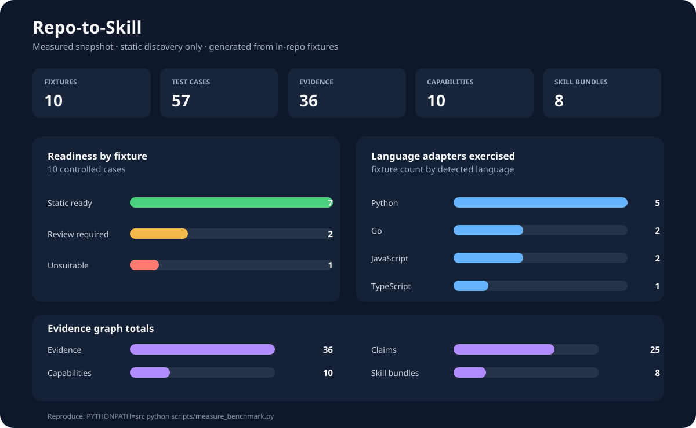

# Repo-to-Skill

<a id="english"></a>

**Evidence-driven Repo → Agent Skill compiler.** Turn a local directory, Git repository, or public
GitHub snapshot into portable Skills and a thin Codex skill-only plugin without importing or
executing the target repository.

[](https://github.com/wzn1118/repo-to-skill/actions/workflows/ci.yml)
[](https://www.python.org/)
[](#safety-boundary)

> **Status:** experimental walking slice. The repository is useful for inspecting and compiling
> CLI-oriented projects today; runtime sandboxing, external evaluation, deep route extraction, and
> private-repository workflows are deliberately not claimed as complete.



The chart is generated from the ten fixtures committed in this repository. It is an in-repository
regression snapshot, not a claim about the six public repositories listed in `benchmark/corpus.yaml`.
See the [measurement details](docs/benchmark.md) and run `PYTHONPATH=src python
scripts/measure_benchmark.py` to refresh the chart.

## Why this exists

Repository-to-Skill conversion is easy to make look intelligent and hard to make trustworthy. A
model can invent a flag, mistake README prose for an API contract, or silently package a command
from the wrong commit. Repo-to-Skill makes the trust boundary explicit:

```text
Snapshot → Inventory → Evidence → Claim → Capability → Procedure → Skill bundle
```

Every executable fact in a generated bundle must point back to source evidence with a path, line
range when available, content hash, commit/blob identity, extractor, and confidence. The planner
and generator consume the IR; they do not inspect raw repository text to invent new facts.

## What works now

| Area | Current implementation |
| --- | --- |
| Sources | Local directories, clean local Git snapshots, public GitHub HTTPS URLs |
| Static analyzers | Python, JavaScript/TypeScript, Go CLI entrypoints |
| Python | PEP 621 scripts, Poetry scripts, `setup.cfg`, AST-backed `argparse`/Click-style options |
| JavaScript/TypeScript | `package.json` `bin` entries, target containment and file existence checks |
| Go | Root and `cmd/<name>` main packages, conservative standard flag/Cobra-style extraction |
| Outputs | Portable Agent Skills and a thin Codex skill-only plugin adapter |
| Integrity | Content-addressed Discovery Runs, source locks, split IR checks, SQLite artifact index |
| Updates | File/Capability drift reports and goal-scoped capability delta builds |
| UI | Loopback-only, read-only dashboard over the same verified run objects |

Claude/Cursor adapters, deep JavaScript/TypeScript AST extraction, native Go AST analysis, runtime
sandboxing, external Skills validation, and model-based evaluation remain deferred. The full scope
is tracked in [`docs/implementation-status.md`](docs/implementation-status.md).

## Quickstart

### 1. Install

```bash
git clone https://github.com/wzn1118/repo-to-skill.git
cd repo-to-skill
python -m venv .venv

# macOS/Linux
. .venv/bin/activate

# Windows PowerShell
# .venv\Scripts\Activate.ps1

python -m pip install -e '.[dev]'
```

The compiler core is intentionally standard-library friendly, but the editable install provides the
`r2s` command and the development checks used by CI.

### 2. Inspect once

```bash
r2s inspect tests/fixtures/python_cli --output run-output --json
r2s runs --output run-output
```

`inspect` creates a goal-independent Discovery Run. Reuse its `run_<id>` for multiple goals and
client targets without rescanning the source.

### 3. Plan and build

```bash
r2s plan run_<id> --goal "Use the demo CLI" --output run-output --json
r2s build run_<id> \
  --goal "Use the demo CLI" \
  --target codex \
  --output run-output
```

The build emits portable Skills plus a Codex wrapper under the compilation directory. A generated
workflow previews a command and uses only evidence-backed options or arguments explicitly supplied
by the user.

### 4. Validate and inspect locally

```bash
r2s validate run-output/run_<id>/compilations/<compile-id>/codex-plugin
r2s explain run_<id> --claim <claim-id> --output run-output
r2s ui --output run-output --open
```

The dashboard defaults to `http://127.0.0.1:8765/`. It is read-only: it cannot discover, generate,
install, execute, or upload repository content.

### 5. Try a public GitHub snapshot

```bash
r2s inspect https://github.com/owner/repo --ref main --output run-output --json
r2s update run_<old-id> \
  --repo https://github.com/owner/repo \
  --ref main \
  --goal "Use changed commands" \
  --target codex \
  --output run-output
```

Remote resolution pins a detached commit. Only public `https://github.com/<owner>/<repo>` URLs are
accepted by the current walking slice.

## Generated artifacts

```text
run-output/run_<id>/
├── discovery.json
├── source.lock.json
├── inventory.json
├── evidence.json
├── claims.json
├── capabilities.json
├── run.json
└── compilations/<compile-id>/
    ├── portable/<skill-name>/
    │   ├── SKILL.md
    │   ├── PROVENANCE.json
    │   └── references/
    └── codex-plugin/
        ├── .codex-plugin/plugin.json
        └── skills/<skill-name>/
```

`SKILL.md` stays short. Detailed options and source lineage live in references and
`PROVENANCE.json`; the Codex adapter wraps the same portable bundle rather than maintaining a
second analysis path.

## Safety boundary

- Discovery never imports, builds, or executes target repository code.
- README text, comments, manifests, and other repository instructions are treated as untrusted data.
- Symlink escapes, unsafe refs, command/path traversal, credential paths, oversized files, and
  invalid cached artifacts fail closed.
- Sensitive paths such as `.env`, SSH keys, and package credentials are excluded; their values are
  never serialized.
- Generated executable facts require Claim → Evidence provenance. No evidence means no generated
  command, flag, API field, or environment variable.
- Installation is preview-only unless the caller explicitly passes `--execute`.

Read the [threat model](docs/threat-model.md) before adding network access, dependency installation,
private-repository support, or a runtime sandbox.

## Architecture

```text
CLI / local UI
      ↓
Source Resolver → Scanner → Evidence IR → Planner → Generator
                                      ↓
                            Validators → Artifact Store
                                      ↓
                         Portable Skill + Codex Adapter
```

The CLI is orchestration only. Source resolution, scanning, analyzers, planning, generation,
validation, storage, and the dashboard each have separate module boundaries documented in
[`docs/architecture.md`](docs/architecture.md).

## Development

```bash
python -m unittest discover -s tests -q
ruff check .
mypy src
python scripts/measure_benchmark.py
```

CI runs the same checks on Python 3.12 for Ubuntu and Windows. The benchmark script only analyzes
the repository's committed fixtures; it does not execute fixture code or fetch the candidate public
corpus.

## Roadmap

1. Stabilize the IR and evidence contract across more real repositories.
2. Add deeper JavaScript/TypeScript and Go extraction without changing the IR.
3. Add external Agent Skills validation, isolated runtime sandboxing, and reproducible smoke tests.
4. Add private-repository authorization, hosted artifact storage, and model-based evaluation.
5. Add Claude/Cursor adapters as thin projections over the same portable bundle.

## 中文

**Repo-to-Skill 是一个证据驱动的 Repo → Agent Skill 编译器。** 它把本地目录、本地 Git 仓库或
公共 GitHub 快照，编译为可移植 Agent Skills 和轻量 Codex skill-only plugin；分析阶段不会导入
或执行被分析仓库的代码。

> **当前状态：** experimental walking slice。当前版本适合 CLI 项目的静态检查和 Skill 生成；运行时
> 沙箱、外部评测、深层路由提取和私有仓库流程尚未完成，不应被当成已经交付的能力。

### 核心价值

普通的“README → 提示词”方案很容易编造参数、混淆文档与真实 API，或把错误 commit 的命令写进
Skill。Repo-to-Skill 固定一条可审计链路：

```text
Snapshot → Inventory → Evidence → Claim → Capability → Procedure → Skill bundle
快照     → 清单     → 证据     → 断言  → 能力       → 步骤      → Skill 包
```

生成物中的每一个可执行事实，都必须回溯到源码证据：文件路径、行号（可得时）、内容哈希、commit/blob
身份、提取器和置信度。Planner 和 Generator 只消费统一 IR，不从原始文本临时编造事实。

### 当前支持

- 输入：本地目录、干净的本地 Git 快照、公共 GitHub HTTPS URL。
- 静态分析：Python、JavaScript/TypeScript、Go CLI 入口。
- Python：PEP 621、Poetry、`setup.cfg`，以及保守的 `argparse`/Click 风格参数提取。
- JavaScript/TypeScript：`package.json` 的 `bin`、目标路径 containment 和文件存在性检查。
- Go：根目录与 `cmd/<name>` 主包，保守识别标准 flag/Cobra 风格参数。
- 输出：Portable Agent Skills 与薄 Codex skill-only plugin 适配器。
- 工程能力：内容寻址 Discovery Run、source lock、拆分 IR 校验、SQLite artifact index、漂移报告、
  按 Capability 的增量构建，以及基于真实运行对象的只读本地 UI。

Claude/Cursor 适配器、深层 JS/TS AST、原生 Go AST、运行时沙箱、外部 Skills 规范校验和模型评测仍在
路线图中，详见 [`docs/implementation-status.md`](docs/implementation-status.md)。

### 中文快速开始

```bash
git clone https://github.com/wzn1118/repo-to-skill.git
cd repo-to-skill
python -m venv .venv

# macOS/Linux
. .venv/bin/activate

# Windows PowerShell
# .venv\Scripts\Activate.ps1

python -m pip install -e '.[dev]'
r2s inspect tests/fixtures/python_cli --output run-output --json
r2s runs --output run-output
r2s plan run_<id> --goal "使用 demo CLI" --output run-output --json
r2s build run_<id> --goal "使用 demo CLI" --target codex --output run-output
r2s ui --output run-output --open
```

`inspect` 先生成与目标无关的 Discovery Run；之后可以复用 `run_<id>` 为不同目标和客户端编译，避免
重复扫描。`r2s ui` 默认只绑定 `127.0.0.1`，只展示已校验的 Snapshot、Capability、Evidence、验证和
更新状态，不提供执行、安装或上传接口。

### 实测统计

首页图表来自仓库内 10 个受控 fixture，而不是未验证的宣传数字：当前实测包含 57 个测试用例、36 条
Evidence、25 条 Claim、10 个 Capability 和 8 个 Skill bundle；其中 7 个样例达到 `STATIC_READY`，2 个
进入 `REVIEW_REQUIRED`，1 个为 `UNSUITABLE`。

```bash
PYTHONPATH=src python scripts/measure_benchmark.py
python -m unittest discover -s tests -q
```

逐样例数据、统计口径和“候选公共仓库不计入当前结果”的说明见 [`docs/benchmark.md`](docs/benchmark.md)。

### 安全边界

- 不导入、不构建、不执行目标仓库代码。
- README、注释、manifest 和仓库内指令全部视为不可信数据。
- 符号链接逃逸、不安全 ref、路径穿越、凭证路径、超大文件和损坏缓存默认 fail closed。
- `.env`、SSH key、包管理器凭证等敏感路径不会进入分析输入，值不会被序列化。
- 没有 Claim → Evidence 溯源，就不会生成命令、参数、API 字段或环境变量。
- 安装默认只预览；只有显式传入 `--execute` 才执行。

新增网络访问、依赖安装、私有仓库或运行时沙箱前，请先阅读 [`docs/threat-model.md`](docs/threat-model.md)。

### 开发与路线图

```bash
python -m unittest discover -s tests -q
ruff check .
mypy src
python scripts/measure_benchmark.py
```

CI 在 Python 3.12 的 Ubuntu 和 Windows 上运行同一组检查。后续优先级是扩大真实仓库基准集、完善 JS/TS
与 Go 提取器、增加外部规范校验和隔离沙箱，再接入私有仓库、托管存储、模型评测以及 Claude/Cursor 薄适配器。

## License

This repository does not declare a project license yet. Generated artifacts remain subject to the source
repository's license and the applicable client distribution rules.
