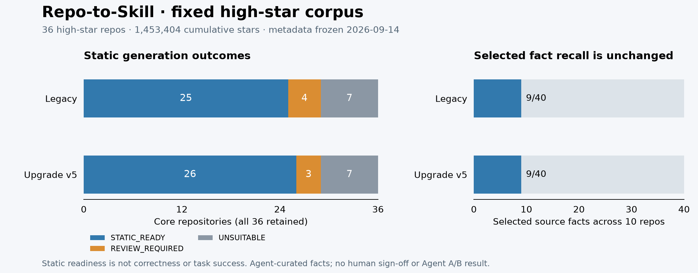
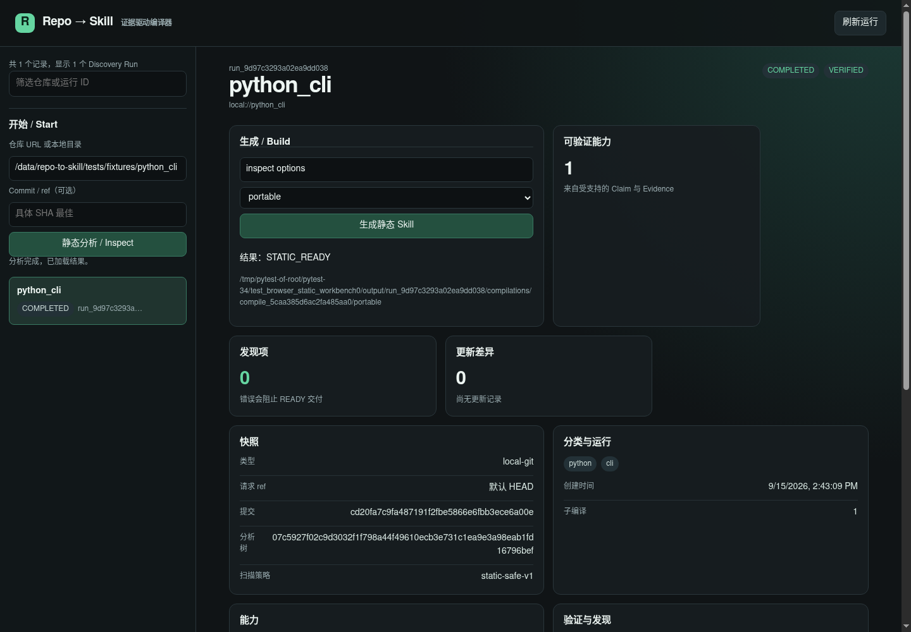

# Repo-to-Skill

<a id="english"></a>

**Evidence-driven Repo → Agent Skill compiler.** Turn a local directory, Git repository, or public
GitHub snapshot into portable Skills and a thin Codex skill-only plugin without importing or
executing the target repository.

[](https://github.com/wzn1118/repo-to-skill/actions/workflows/ci.yml)
[](https://www.python.org/)
[](#safety-boundary)

> **Status:** experimental. The compiler has deterministic artifact re-rendering,
> managed install receipts and rollback, isolated `verify` preview/execute policy, a loopback UI for static
> runs, and thin client projections. Claude/Cursor native loading is not verified. Runtime task evaluation, agent A/B evidence and
> private/hosted workflows remain incomplete.

[English](#english) · [中文](#中文) · [Latest measured run](benchmark/runs/2026-09-15-upgrade-v5/report.md) · [Legacy benchmark](benchmark/report.md) · [Upgrade progress](docs/upgrade-status.md) · [Official gh comparison](docs/case-studies/github-cli.md)

## Public Repo Benchmark 1.0

**High-Star Public Repositories Tested: 36** — plus 6 Rust challenges and 3 secondary edge cases.
All 45 source snapshots are pinned and verified. The Core represents **1,453,404 cumulative GitHub
stars**, using the saved `2026-09-14` snapshot; stars are not unique users.

| Measured result | Value |
| --- | ---: |
| Core static generation | 26 STATIC_READY · 3 REVIEW_REQUIRED · 7 UNSUITABLE |
| Star-weighted coverage, using static-generation status | 69.7% |
| Ground truth across 10 repositories | **9 / 40 selected facts covered** |
| Tasks with all selected static prerequisites covered | **1 / 30** |
| Generated executable facts indexed / hash-and-pin checked | 49 / 49; full semantic review pending |
| Four known Go module-suffix name regressions | 4 / 4 corrected against pinned source |

STATIC_READY does not guarantee correct commands or successful tasks. The audit caught Go module
suffixes becoming executable names (`v2`, `v4`), test fixtures becoming Skills, and missing subcommands.
The ground truth is **agent-curated**, not human sign-off. No zero-hallucination or
with/without-skill improvement claim is made. Failures are published alongside successes.

The versioned [upgrade-v5 report](benchmark/runs/2026-09-15-upgrade-v5/report.md) contains the
compiler fingerprint, raw static results, targeted name checks and explicit limits. TypeScript and
webpack still exceed scanner limits. Selected fact recall remains **9/40** after the fixes. The
older headline remains in `benchmark/report.md` as a legacy measurement; it is not overwritten.



```bash
python scripts/public_measure.py run --work /path/on/data-disk/new-run --output benchmark/runs/new-run/results.json
python scripts/public_evaluate.py --work /path/on/data-disk/new-run --results benchmark/runs/new-run/results.json --output-dir benchmark/runs/new-run
python scripts/public_fact_audit.py --work /path/on/data-disk/new-run --results benchmark/runs/new-run/results.json --output benchmark/runs/new-run/fact-audit.json
python scripts/render_run_report.py --run benchmark/runs/new-run
```

Python 3.12+ is required; chart export also needs `matplotlib`. Full reproduction, runtime policy,
per-repository failures and raw JSON are in the [benchmark report](benchmark/report.md).
Install benchmark tooling with `python -m pip install -e '.[dev,benchmark]'`.
The [official gh comparison](docs/case-studies/github-cli.md) finds 1/5 selected facts in the generated
Skill versus 4/5 textual mentions in the official Skill. The former 27.9% bootstrap report is
[retained and superseded](benchmark/history/2026-09-15-bootstrap-results.json).

## Why this exists

Repository-to-Skill conversion is easy to make look intelligent and hard to make trustworthy. A
model can invent a flag, mistake README prose for an API contract, or silently package a command
from the wrong commit. Repo-to-Skill makes the trust boundary explicit:

```text
Snapshot → Inventory → Evidence → Claim → Capability → Procedure → Skill bundle
```

Every executable fact in a generated bundle must point back to source evidence with a path, line
range when available, content hash, commit/blob identity, extractor, and confidence. The planner
and generator consume the IR; they do not inspect raw repository text to invent new facts.

## What works now

| Area | Current implementation |
| --- | --- |
| Sources | Local directories, clean local Git snapshots, public GitHub HTTPS URLs |
| Static analyzers | Python, JavaScript/TypeScript, Go CLI entrypoints |
| Python | PEP 621 scripts, Poetry scripts, `setup.cfg`, AST-backed `argparse`/Click-style options |
| JavaScript/TypeScript | `package.json` `bin` entries, target containment and file existence checks |
| Go | Root and `cmd/<name>` main packages, conservative standard flag/Cobra-style extraction |
| Outputs | Portable Skills, Codex plugin; experimental Claude/Cursor directory projections |
| Integrity | Content-addressed Discovery Runs, source locks, split IR checks, SQLite artifact index |
| Updates | File/Capability drift reports and goal-scoped capability delta builds |
| UI | Loopback workbench: inspect, build, view evidence and validation using the same run objects |
| Execution | Explicit local Docker invocation with a pinned installed image, bounded output and cleanup |
| Installation | Codex destination receipts, conflict checks, staged update and rollback library API |

Deep JavaScript/TypeScript AST extraction, native Go AST analysis, independent external Skills validation,
runtime task success, model-based evaluation and hosted/private workflows remain deferred. The full scope
is tracked in [`docs/implementation-status.md`](docs/implementation-status.md) and
[`docs/upgrade-status.md`](docs/upgrade-status.md).

## Quickstart

### 1. Install

```bash
git clone https://github.com/wzn1118/repo-to-skill.git
cd repo-to-skill
python -m venv .venv

# macOS/Linux
. .venv/bin/activate

# Windows PowerShell
# .venv\Scripts\Activate.ps1

python -m pip install -e '.[dev]'
```

The editable install provides the `r2s` command, strict validation dependencies and development checks.

### 2. Inspect once

```bash
r2s inspect tests/fixtures/python_cli --output run-output --json
r2s runs --output run-output
```

`inspect` creates a goal-independent Discovery Run. Reuse its `run_<id>` for multiple goals and
client targets without rescanning the source.

### 3. Plan and build

```bash
r2s plan run_<id> --goal "Use the demo CLI" --output run-output --json
r2s build run_<id> \
  --goal "Use the demo CLI" \
  --target codex \
  --output run-output
```

The build emits portable Skills plus a Codex wrapper under the compilation directory. A generated
workflow previews a command and uses only evidence-backed options or arguments explicitly supplied
by the user.

### 4. Validate and inspect locally

```bash
r2s validate run-output/run_<id>/compilations/<compile-id>/codex-plugin
r2s explain run_<id> --claim <claim-id> --output run-output
r2s ui --output run-output --open
```

The workbench defaults to `http://127.0.0.1:8765/`. Enter a local source or public GitHub URL,
inspect capabilities, provide a goal and build a Skill. Local sources are restricted to the current
directory; add `--source-root /path/to/projects` to allow another root. Installation and execution
use the CLI. Background jobs, cancellation and artifact downloads remain open work.



For a generated Python Skill, preview an explicit invocation with an already installed Linux image:

```bash
r2s verify /path/to/portable/demo --source tests/fixtures/python_cli \
  --image python:3.12-slim --arg=--output --arg=value
```

Add `--execute --report /path/to/new-execution.json` to run it. The runner resolves the local image
to its digest, copies filtered source into a temporary snapshot, disables container networking and
records output, limits and cleanup. It never pulls images or installs dependencies. A zero exit code
does not prove a task passed; Go/build-dependent entrypoints still require a supported build profile.

### 5. Try a public GitHub snapshot

```bash
r2s inspect https://github.com/owner/repo --ref main --output run-output --json
r2s update run_<old-id> \
  --repo https://github.com/owner/repo \
  --ref main \
  --goal "Use changed commands" \
  --target codex \
  --output run-output
```

Remote resolution pins a detached commit. Only public `https://github.com/<owner>/<repo>` URLs are
accepted by the current walking slice.

## Generated artifacts

```text
run-output/run_<id>/
├── discovery.json
├── source.lock.json
├── inventory.json
├── evidence.json
├── claims.json
├── capabilities.json
├── run.json
└── compilations/<compile-id>/
    ├── portable/<skill-name>/
    │   ├── SKILL.md
    │   ├── PROVENANCE.json
    │   ├── BUNDLE.lock.json
    │   └── references/
    └── codex-plugin/
        ├── .codex-plugin/plugin.json
        └── skills/<skill-name>/
```

`SKILL.md` stays short. Detailed options and source lineage live in references and
`PROVENANCE.json`; the Codex adapter wraps the same portable bundle rather than maintaining a
second analysis path.

## Safety boundary

- Discovery never imports, builds, or executes target repository code.
- README text, comments, manifests, and other repository instructions are treated as untrusted data.
- Symlink escapes, unsafe refs, command/path traversal, credential paths, oversized files, and
  invalid cached artifacts fail closed.
- Sensitive paths such as `.env`, SSH keys, and package credentials are excluded; their values are
  never serialized.
- Generated executable facts require Claim → Evidence provenance. No evidence means no generated
  command, flag, API field, or environment variable.
- Installation is preview-only unless the caller explicitly passes `--execute`.

Read the [threat model](docs/threat-model.md) before adding network access, dependency installation,
private-repository support, or extending the runtime sandbox.

## Architecture

```text
CLI / local UI
      ↓
Source Resolver → Scanner → Evidence IR → Planner → Generator
                                      ↓
                            Validators → Artifact Store
                                      ↓
                         Portable Skill + Codex Adapter
```

The CLI is orchestration only. Source resolution, scanning, analyzers, planning, generation,
validation, storage, and the dashboard each have separate module boundaries documented in
[`docs/architecture.md`](docs/architecture.md).

## Development

```bash
python -m pytest
ruff check .
mypy src
python scripts/measure_benchmark.py
```

CI runs pytest, Ruff and mypy on Python 3.12 for Ubuntu and Windows. `measure_benchmark.py` only
analyzes committed fixtures. Public measurements are separate, opt-in scripts documented in the
[reproduction guide](docs/benchmark.md); network downloads and Docker execution do not run in CI.

## Roadmap

1. Stabilize the IR and evidence contract across more real repositories.
2. Add deeper JavaScript/TypeScript and Go extraction without changing the IR.
3. Expand the product sandbox from smoke verification to replayable TaskSpec execution and add external Skills validation.
4. Add private-repository authorization, hosted artifact storage, and model-based evaluation.
5. Add client discovery compatibility tests and then maintain Claude/Cursor adapters as thin projections over the same portable bundle.

## 中文

**Repo-to-Skill 是一个证据驱动的 Repo → Agent Skill 编译器。** 它把本地目录、本地 Git 仓库或
公共 GitHub 快照，编译为可移植 Agent Skills 和轻量 Codex skill-only plugin；分析阶段不会导入
或执行被分析仓库的代码。

> **当前状态：** 可运行的实验版本。已加入严格产物重渲染、安装 receipt、隔离 `verify`、
> 可写的 loopback 静态工作台，以及 Codex/Claude/Cursor 薄适配器；运行任务评测、Agent A/B、
> 私有仓库和托管流程仍未完成。

### 核心价值

普通的“README → 提示词”方案很容易编造参数、混淆文档与真实 API，或把错误 commit 的命令写进
Skill。Repo-to-Skill 固定一条可审计链路：

```text
Snapshot → Inventory → Evidence → Claim → Capability → Procedure → Skill bundle
快照     → 清单     → 证据     → 断言  → 能力       → 步骤      → Skill 包
```

生成物中的每一个可执行事实，都必须回溯到源码证据：文件路径、行号（可得时）、内容哈希、commit/blob
身份、提取器和置信度。Planner 和 Generator 只消费统一 IR，不从原始文本临时编造事实。

### 当前支持

- 输入：本地目录、干净的本地 Git 快照、公共 GitHub HTTPS URL。
- 静态分析：Python、JavaScript/TypeScript、Go CLI 入口。
- Python：PEP 621、Poetry、`setup.cfg`，以及保守的 `argparse`/Click 风格参数提取。
- JavaScript/TypeScript：`package.json` 的 `bin`、目标路径 containment 和文件存在性检查。
- Go：根目录与 `cmd/<name>` 主包，保守识别标准 flag/Cobra 风格参数。
- 输出：Portable Agent Skills 与薄 Codex skill-only plugin 适配器。
- 工程能力：内容寻址 Discovery Run、source lock、拆分 IR 校验、SQLite artifact index、漂移报告、
  按 Capability 的增量构建，以及可提交静态分析与生成任务的本地 UI。
- 验证与分发：产物重渲染核验、文件锁、Codex 安装 receipt/更新/回滚；显式 Docker 执行与清理记录。
- Claude/Cursor 目前仅输出目录投影，尚未验证原生客户端加载。

深层 JS/TS AST、原生 Go AST、独立 Skills 规范校验、运行任务效果、模型评测、私有仓库和托管流程仍在
路线图中，详见 [`docs/implementation-status.md`](docs/implementation-status.md) 与
[`docs/upgrade-status.md`](docs/upgrade-status.md)。

### 中文快速开始

```bash
git clone https://github.com/wzn1118/repo-to-skill.git
cd repo-to-skill
python -m venv .venv

# macOS/Linux
. .venv/bin/activate

# Windows PowerShell
# .venv\Scripts\Activate.ps1

python -m pip install -e '.[dev]'
r2s inspect tests/fixtures/python_cli --output run-output --json
r2s runs --output run-output
r2s plan run_<id> --goal "使用 demo CLI" --output run-output --json
r2s build run_<id> --goal "使用 demo CLI" --target codex --output run-output
r2s ui --output run-output --open
```

`inspect` 先生成与目标无关的 Discovery Run；之后可以复用 `run_<id>` 为不同目标和客户端编译，避免
重复扫描。`r2s ui` 默认只绑定 `127.0.0.1`，可输入仓库、静态分析、按目标生成，并查看证据和验证结果。
本地来源限于当前目录，可用 `--source-root /path/to/projects` 增加允许范围。安装和执行通过 CLI；
后台任务、取消和产物下载尚未完成。

### 实测统计

首页展示固定公共仓库实测，受控 fixture 与公共 headline 分开统计。真实浏览器和 Docker
回归的范围、复现命令和局限见 [升级状态](docs/upgrade-status.md)，不用于推算 Agent 任务成功率。

```bash
PYTHONPATH=src python scripts/measure_benchmark.py
python -m pytest
```

逐样例回归数据见 [`docs/benchmark.md`](docs/benchmark.md)，公共结果见 [`benchmark/report.md`](benchmark/report.md)。

### 公共高 Star 基准集

首份 Public Repo Benchmark 1.0 不用小型 toy repo 凑成功率，而是固定真实、高使用量、CLI 边界复杂的公共仓库。
`2026-09-14` 的 GitHub 元数据快照包含 **36 个 High-Star Core Repository**（Tier A 16 个、Tier B 20 个）、
**1,453,404 个累计 stars**、10 个 ground-truth 仓库、6 个不支持语言 challenge 和 3 个 Tier C edge case。
Stars 只描述 corpus 的开源影响力，不等于独立用户数。

**High-Star Public Repositories Tested: 36**。45 个真实源码快照（含 challenge/edge）均已固定并验证；
最新 [upgrade-v5](benchmark/runs/2026-09-15-upgrade-v5/report.md) 的 Core 结果为 26 个 `STATIC_READY`、
3 个 `REVIEW_REQUIRED`、7 个 `UNSUITABLE`，按静态状态计算的 Star-weighted coverage 为 **69.7%**。
TypeScript、webpack 仍因扫描限额失败，全部保留在分母中。

更关键的结果是：10 仓库的 40 条源码事实只覆盖 **9 条**，30 个任务中仅 **1 个**具备所选静态前提。
新版本生成 **49 条**可执行事实，均通过哈希和 commit 核对；四项 Go 后缀命名回归已按固定源码核对修复，
pnpm、bat、goreleaser 的已知测试入口误报已移除。**49 条事实仍待完整语义审计**，减少输出不代表准确率提高。
旧版的 91 条事实、4 个已确认错误及四项目 10 项运行检查保留在 legacy 报告，不移作新版运行成绩。

ground truth 由 Agent 按源码整理，不冒称人工签字；没有提前写“零幻觉”，也没有声称优于官方 Skill。
旧版 27.9% 报告因 Python 3.10 fallback、未验证缓存和未实际扫描的 challenge 已被更正，历史数据保留。

```bash
python scripts/public_measure.py run --work /path/on/data-disk/new-run --output benchmark/runs/new-run/results.json
python scripts/public_evaluate.py --work /path/on/data-disk/new-run --results benchmark/runs/new-run/results.json --output-dir benchmark/runs/new-run
python scripts/public_fact_audit.py --work /path/on/data-disk/new-run --results benchmark/runs/new-run/results.json --output benchmark/runs/new-run/fact-audit.json
python scripts/render_run_report.py --run benchmark/runs/new-run
```

基准输入见 [`benchmark/corpus.yaml`](benchmark/corpus.yaml) 和 [`benchmark/ground-truth.yaml`](benchmark/ground-truth.yaml)，
快照见 [`benchmark/repository-metadata.json`](benchmark/repository-metadata.json)，GitHub CLI 官方 Skill 对照见
[`docs/case-studies/github-cli.md`](docs/case-studies/github-cli.md)。

### 安全边界

- discovery / compilation 不导入、不构建、不执行目标代码；独立 runtime benchmark 需显式 `--execute` 并使用隔离容器。
- README、注释、manifest 和仓库内指令全部视为不可信数据。
- 符号链接逃逸、不安全 ref、路径穿越、凭证路径、超大文件和损坏缓存默认 fail closed。
- `.env`、SSH key、包管理器凭证等敏感路径不会进入分析输入，值不会被序列化。
- 没有 Claim → Evidence 溯源，就不会生成命令、参数、API 字段或环境变量。
- 安装默认只预览；只有显式传入 `--execute` 才执行。

新增网络访问、依赖安装、私有仓库或运行时沙箱前，请先阅读 [`docs/threat-model.md`](docs/threat-model.md)。

### 开发与路线图

```bash
python -m unittest discover -s tests -q
ruff check .
mypy src
python scripts/measure_benchmark.py
```

CI 在 Python 3.12 的 Ubuntu 和 Windows 上运行同一组检查。后续优先级是扩大真实仓库基准集、完善 JS/TS
与 Go 提取器、增加外部规范校验和隔离沙箱，再接入私有仓库、托管存储、模型评测以及 Claude/Cursor 薄适配器。

## License

This repository does not declare a project license yet. Generated artifacts remain subject to the source
repository's license and the applicable client distribution rules.
