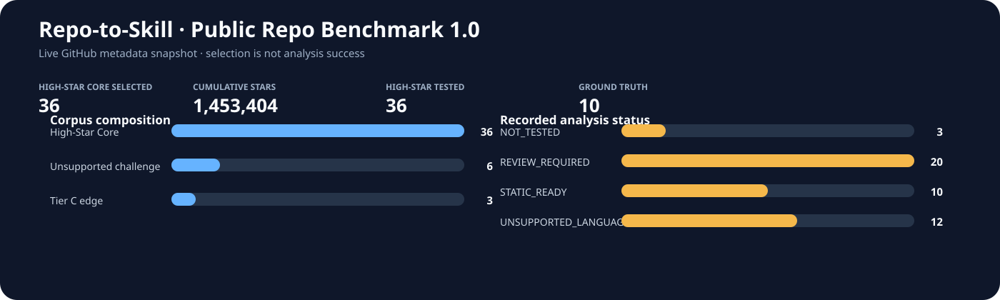

# Public Repo Benchmark 1.0 — measured results / 实测结果

**High-Star Public Repositories Tested: 36**

36 Core · 1,453,404 cumulative GitHub stars. Stars describe the corpus, not unique users.



## Scope / 口径

Every source is commit-pinned and hashed. All languages go through the unmodified scanner, analyzers, portable generator and internal validator. No repository code runs during discovery. Separate containers perform explicitly requested runtime checks.

所有语言都实际经过原有编译器，不按 metadata 预判成功/不支持。STATIC_READY 只代表内部静态校验；不保证产品入口正确、参数完整或真实任务成功。下载失败、扫描限额和辅助脚本误报均保留。

| Metric | Measured value |
| --- | ---: |
| Core attempts / completed pipelines | 36 / 34 |
| Core STATIC_READY | 25 / 36 |
| Star-weighted coverage (static-generation definition) | 69.0% |
| Generated executable facts (Core) | 91 |
| Fact provenance: file hash + commit verified | 91 |
| Confirmed wrong executable names | 4; remaining 87 facts not semantically reviewed |
| Selected ground-truth facts covered | 9 / 40 |
| Source-verified ground-truth facts | 40 / 40 |
| Tasks with all selected static prerequisites covered | 1 / 30 |
| Human-verified repositories | 0 |
| Hallucination rate / with-vs-without-skill task uplift | Not measured |

Coverage denominator is **all selected Core stars**, including failed attempts. Hash provenance proves traceability; it does not prove semantic correctness. The selected facts are a small, agent-curated sample, not an exhaustive CLI inventory.

## Per-repository outcomes / 逐仓库结果

| Repository | Set / tier | Stars | Outcome | Bundles | Failure |
| --- | --- | ---: | --- | ---: | --- |
| [yt-dlp/yt-dlp](https://github.com/yt-dlp/yt-dlp/tree/bbc809a1161d3bfca51fa36f59dda35556ee85a0) | core / A | 191,182 | STATIC_READY | 1 | — |
| [psf/black](https://github.com/psf/black/tree/20622e1259c29bda81831962ace1348ba1921c84) | core / A | 41,842 | STATIC_READY | 2 | — |
| [Textualize/rich](https://github.com/Textualize/rich/tree/9d8f9a372cc5916fd4781fec207ced7ddac2f08f) | core / A | 57,363 | UNSUITABLE | 0 | NO_ACTIONABLE_CAPABILITY |
| [httpie/cli](https://github.com/httpie/cli/tree/5b604c37c6c67e18e7c3e9aee6c88a8c22b98345) | core / A | 38,512 | STATIC_READY | 3 | — |
| [python-poetry/poetry](https://github.com/python-poetry/poetry/tree/be56ff07db06e9b82574648433ca228e4cac549b) | core / A | 34,304 | STATIC_READY | 1 | — |
| [prettier/prettier](https://github.com/prettier/prettier/tree/0017ecf34df0b6a0bdd156bb02fe62603d4aa682) | core / A | 52,263 | STATIC_READY | 1 | — |
| [vitejs/vite](https://github.com/vitejs/vite/tree/99bd9d1d46153fa939f4a304cc0177db42e28776) | core / A | 82,823 | STATIC_READY | 3 | — |
| [webpack/webpack](https://github.com/webpack/webpack/tree/9dc7f1a65c21f80d70ec80e45e9a9390bb5e9b04) | core / A | 65,948 | REVIEW_REQUIRED | 0 | FILE_COUNT_LIMIT_EXCEEDED |
| [microsoft/TypeScript](https://github.com/microsoft/TypeScript/tree/57d9528db25b8dc8375e18468a870ec3f4277d62) | core / A | 111,047 | REVIEW_REQUIRED | 0 | FILE_COUNT_LIMIT_EXCEEDED |
| [cli/cli](https://github.com/cli/cli/tree/38316c1c4f275030e3df6666382922e75410d68b) | core / A | 46,279 | STATIC_READY | 2 | — |
| [gohugoio/hugo](https://github.com/gohugoio/hugo/tree/a374b865f7e99cccafcbe443dcdb47552b91af3c) | core / A | 89,819 | STATIC_READY | 1 | — |
| [junegunn/fzf](https://github.com/junegunn/fzf/tree/b1be3a8be1b833ce5b92fbbac11637643d60a046) | core / A | 82,984 | STATIC_READY | 1 | — |
| [jqlang/jq](https://github.com/jqlang/jq/tree/9d241e277204b83c4a7ddc7d733e5c72f99ef500) | core / A | 35,598 | UNSUITABLE | 0 | NO_ACTIONABLE_CAPABILITY |
| [koalaman/shellcheck](https://github.com/koalaman/shellcheck/tree/9af7ee28ce587baadd950b85dd6826a16b9c068d) | core / A | 40,036 | UNSUITABLE | 0 | NO_ACTIONABLE_CAPABILITY |
| [nektos/act](https://github.com/nektos/act/tree/4f411281417e88660bea1c1a1749aa71ae0bd60f) | core / A | 72,004 | STATIC_READY | 1 | — |
| [pnpm/pnpm](https://github.com/pnpm/pnpm/tree/8f20a3fd69748b1f6eb5c6a7c54d5917456a2013) | core / A | 36,524 | REVIEW_REQUIRED | 24 | COMMAND_CONFLICT |
| [pytest-dev/pytest](https://github.com/pytest-dev/pytest/tree/53bc06b9933eb50b40cd904aa50bcd1b6cf2a49c) | core / B | 14,506 | STATIC_READY | 2 | — |
| [pre-commit/pre-commit](https://github.com/pre-commit/pre-commit/tree/a9bba55a3f74068b53f4bd4d831d7e05e34eae6c) | core / B | 15,572 | STATIC_READY | 1 | — |
| [cookiecutter/cookiecutter](https://github.com/cookiecutter/cookiecutter/tree/c88fbe921c97c58b65f1883ba90a0ab53cc91b34) | core / B | 25,087 | STATIC_READY | 1 | — |
| [pallets/click](https://github.com/pallets/click/tree/6aabf099bfdd4c1e75fe8d0e0d4241372b988ab1) | core / B | 17,665 | UNSUITABLE | 0 | NO_ACTIONABLE_CAPABILITY |
| [eslint/eslint](https://github.com/eslint/eslint/tree/24310e3a0e22b3c086ca402f88448676f2e1cfcd) | core / B | 27,506 | STATIC_READY | 1 | — |
| [npm/cli](https://github.com/npm/cli/tree/c9876d7ea7150b0702e4151210b9fa1a8dbc7fbf) | core / B | 10,114 | REVIEW_REQUIRED | 5 | COMMAND_CONFLICT |
| [goreleaser/goreleaser](https://github.com/goreleaser/goreleaser/tree/2ab310007902c215786382916e7e00477de597c4) | core / B | 16,048 | STATIC_READY | 3 | — |
| [charmbracelet/gum](https://github.com/charmbracelet/gum/tree/7179388031ae67d7f538d001be87d931f1cf5e28) | core / B | 24,371 | STATIC_READY | 1 | — |
| [FiloSottile/age](https://github.com/FiloSottile/age/tree/b74dce4cdbe35b5e5f66c06d9612b72f89028758) | core / B | 23,579 | STATIC_READY | 4 | — |
| [mikefarah/yq](https://github.com/mikefarah/yq/tree/8b5af0694bb82b41d4ae180fac9972029066f90a) | core / B | 15,956 | STATIC_READY | 1 | — |
| [hadolint/hadolint](https://github.com/hadolint/hadolint/tree/2bd38b6377d24f3754979e25efc85a6a411da3fb) | core / B | 12,402 | UNSUITABLE | 0 | NO_ACTIONABLE_CAPABILITY |
| [direnv/direnv](https://github.com/direnv/direnv/tree/b00e451f547f39be7ab836d969054114a465a0f9) | core / B | 15,445 | STATIC_READY | 1 | — |
| [charmbracelet/vhs](https://github.com/charmbracelet/vhs/tree/db96d7374f7d7a3774f69a43f4fcc5c5a1fd74e3) | core / B | 20,901 | STATIC_READY | 1 | — |
| [pypa/pipx](https://github.com/pypa/pipx/tree/acf217490c823faa6af848a32324aa882affad09) | core / B | 12,963 | STATIC_READY | 1 | — |
| [pypa/pip](https://github.com/pypa/pip/tree/2b28a816d043826f2ba10ff1d22ec3d94d2ed7c5) | core / B | 10,286 | STATIC_READY | 2 | — |
| [python/mypy](https://github.com/python/mypy/tree/4fa665256c52b09ff20fb91af45dfa005f8a27e8) | core / B | 20,640 | STATIC_READY | 5 | — |
| [simonw/llm](https://github.com/simonw/llm/tree/1df47ddcac20d58726a993949da8ef84f4081085) | core / B | 12,505 | STATIC_READY | 1 | — |
| [so-fancy/diff-so-fancy](https://github.com/so-fancy/diff-so-fancy/tree/8c03d4a5023c47087a35a34f489c242098b0a65c) | core / B | 18,087 | UNSUITABLE | 0 | NO_ACTIONABLE_CAPABILITY |
| [go-task/task](https://github.com/go-task/task/tree/6c0d6e637e9f4c1e67423db18644819470809dd6) | core / B | 16,142 | STATIC_READY | 3 | — |
| [pyenv/pyenv](https://github.com/pyenv/pyenv/tree/676b71e7b52d1a094c6659213c23649b9e290455) | core / B | 45,101 | UNSUITABLE | 0 | NO_ACTIONABLE_CAPABILITY |
| [astral-sh/ruff](https://github.com/astral-sh/ruff/tree/c2cd236b9cc5b2149c74247e179d6567ec74066f) | unsupported-challenge / A | 49,630 | REVIEW_REQUIRED | 0 | FILE_COUNT_LIMIT_EXCEEDED |
| [sharkdp/bat](https://github.com/sharkdp/bat/tree/7323a7514f7601737640e7172be115127d6db08c) | unsupported-challenge / A | 60,453 | REVIEW_REQUIRED | 1 | LICENSE_MISSING |
| [BurntSushi/ripgrep](https://github.com/BurntSushi/ripgrep/tree/3fce3b5bb0236da2df6d99672afb8a719642eca7) | unsupported-challenge / A | 68,263 | UNSUITABLE | 0 | NO_ACTIONABLE_CAPABILITY |
| [sharkdp/fd](https://github.com/sharkdp/fd/tree/b422e5d8c9cffaa1ae43ba68e7b97a60fb3e8ae5) | unsupported-challenge / A | 44,405 | REVIEW_REQUIRED | 0 | LICENSE_MISSING, NO_ACTIONABLE_CAPABILITY |
| [starship/starship](https://github.com/starship/starship/tree/c5f2cc5d165b7dc62f2b653e2cb9abf74f33e1d9) | unsupported-challenge / A | 59,899 | UNSUITABLE | 0 | NO_ACTIONABLE_CAPABILITY |
| [astral-sh/uv](https://github.com/astral-sh/uv/tree/85fe61435fe581f88fbc3f154f5ec8c48a045405) | unsupported-challenge / A | 89,816 | REVIEW_REQUIRED | 0 | LICENSE_MISSING, NO_ACTIONABLE_CAPABILITY |
| [pypa/virtualenv](https://github.com/pypa/virtualenv/tree/ca4025d81d5a6372020b720439a1c37a8a51f066) | edge / C | 5,044 | STATIC_READY | 1 | — |
| [watchexec/watchexec](https://github.com/watchexec/watchexec/tree/5361173217302947f7d22099472dfe400479a339) | edge / C | 7,186 | UNSUITABLE | 0 | NO_ACTIONABLE_CAPABILITY |
| [bats-core/bats-core](https://github.com/bats-core/bats-core/tree/2341486183f0b00a6e420770e1f2148758d29377) | edge / C | 6,258 | UNSUITABLE | 0 | NO_ACTIONABLE_CAPABILITY |

## Runtime / 隔离运行

Source read-only; no network during execution; no host keys; non-root; dropped capabilities; CPU, memory, process and time limits. Dependency acquisition occurs separately with network; npm lifecycle scripts are disabled. Python wheels are hashed. Source import paths are checked.

| Repository | Check type | Result |
| --- | --- | --- |
| yt-dlp | Help/version smoke | 3/3 |
| black | Functional formatting | 3/3 |
| poetry | Help/version smoke | 3/3 |
| pre-commit | Help/version smoke | 3/3 |
| prettier | Source build/help attempt | SMOKE_PASSED |
| webpack | Source build/help attempt | BUILD_FAILED |
| github-cli | Source build/help attempt | DEPENDENCY_FAILED |
| hugo | Source build/help attempt | DEPENDENCY_FAILED |
| fzf | Source build/help attempt | SMOKE_PASSED |
| eslint | Source build/help attempt | SMOKE_PASSED |
| prettier | explicit-parser | PASS |
| prettier | check-format | PASS |
| prettier | ignore-file | PASS |
| fzf | filter-input | PASS |
| eslint | lint-with-config | PASS |
| eslint | apply-fix | PASS |
| eslint | ignore-path | PASS |

Help/version checks are not user-task success. Functional checks use synthetic inputs against real pinned source. No agent/model baseline ran; no time/token benefit is claimed.

## Evidence-driven roadmap / 失败驱动路线图

1. Fix Go module suffixes becoming commands: goreleaser/gum/direnv → v2, yq → v4. See [fact audit](fact-audit.json).
2. Exclude test fixtures and developer utilities from product CLI capabilities (bat, npm, pnpm).
3. Extract subcommands and options across files (gh, fzf, Hugo, black, Poetry, yt-dlp).
4. Handle large repositories without silently skipping them (webpack and TypeScript hit scan limits).
5. Resolve multi-license filenames; root LICENSE detection misses LICENSE-MIT / LICENSE-APACHE.
6. Model CLI delegation (webpack → webpack-cli), and pin dependency/toolchain versions for runtime checks.

## Reproduce / 复现

```bash
python scripts/public_measure.py run --work /path/on/data-disk
python scripts/public_evaluate.py --work /path/on/data-disk
python scripts/public_fact_audit.py --work /path/on/data-disk
python scripts/public_runtime.py --work /path/on/data-disk --image <python-image> --execute
python scripts/public_build_runtime.py --work /path/on/data-disk --go-image <go-image> --execute
python scripts/functional_runtime.py --work /path/on/data-disk --execute
python scripts/public_report.py
```

Runtime reproduction requires the recorded wheel set and container images; their hashes/IDs are in the runtime reports. No generated Skill is installed or executed automatically.

Raw data: [results](results.json), [fact audit](fact-audit.json), [ground truth](ground-truth-results.json), [runtime](runtime-results.json), [builds](build-runtime-results.json), [functional](functional-results.json), [official comparison](official-comparison.json).

## Previous report correction / 旧数据更正

The earlier 27.9% report used Python 3.10's limited TOML fallback, accepted incomplete caches, and labeled Rust challenges without scanning. It is retained in [history](history/2026-09-15-bootstrap-results.json) for audit only and is superseded. The new result is not a before/after analyzer improvement claim.
