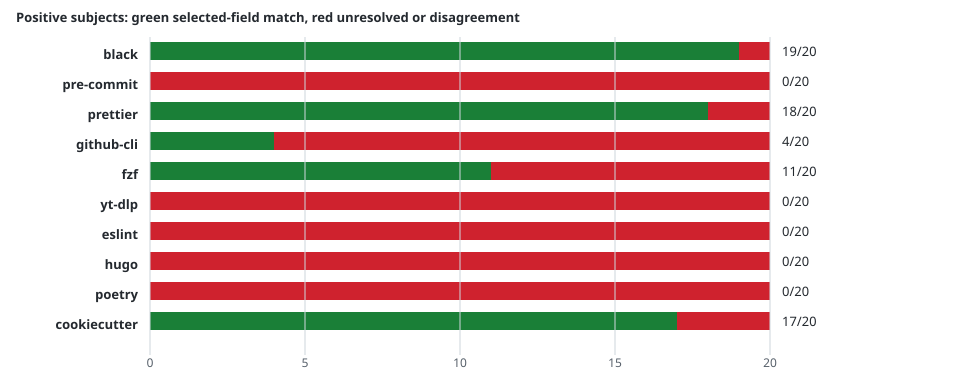

# v23 Semantic Gold Audit

This is a retrospective, agent-curated selected-field comparison against the immutable v22 compiler result. It is not human sign-off, held-out accuracy, complete generated-fact precision, or Agent task uplift.

## Scope

- High-Star repositories: 10
- Cumulative GitHub stars at the frozen benchmark snapshot: 606,838
- Positive operational subjects: 200
- Separate negative probes: 20
- Gold input: `6a0e2c8451786ed5231dc7b3266fc11d9773be69b0469cb1189e5fa0a0f2d8e3`
- Compiler result input: `05732ee1653f85ae4e520965e33098227c9d5fc0fb079888b993bb24b5a5736b`

The gold set is independently authored from pinned source declarations and line anchors. It was frozen after the v22 run; no core analyzer change was made to improve this score. It deliberately selects options and positional arguments that matter to task-oriented Skills. Aliases and choices are checked only where explicitly selected; they are not exhaustive inventories.

## Results

`SELECTED_FIELDS_MATCH` means every selected field for that subject matched. `MISSING_FACT`, `FIELD_MISMATCH`, partial, and ambiguous outcomes remain failures or unknowns. `NEGATIVE_CLEAR` only means the selected false option was not emitted; it is not a zero-hallucination claim.

| Repository | Selected match | Missing | Field mismatch | Partial / ambiguous | Negative clear |
| --- | ---: | ---: | ---: | ---: | ---: |
| `black` | 19 | 0 | 0 | 1 | 2 |
| `pre-commit` | 0 | 20 | 0 | 0 | 2 |
| `prettier` | 18 | 0 | 1 | 1 | 2 |
| `github-cli` | 4 | 16 | 0 | 0 | 2 |
| `fzf` | 11 | 0 | 9 | 0 | 2 |
| `yt-dlp` | 0 | 20 | 0 | 0 | 2 |
| `eslint` | 0 | 20 | 0 | 0 | 2 |
| `hugo` | 0 | 20 | 0 | 0 | 2 |
| `poetry` | 0 | 20 | 0 | 0 | 2 |
| `cookiecutter` | 17 | 2 | 0 | 1 | 2 |



Across positive subjects, 69/200 (34.5%) reached selected-field agreement. The field-level diagnostic is 153 matches, 10 mismatches, and 238 fields without a selected fact. The field ratio must not be read as overall semantic precision because missing facts are not verified fields.

The most visible roadmap signals are the complete pre-commit, yt-dlp, ESLint, Hugo, and Poetry selected cohorts with no matching emitted options; fzf custom argument consumption remains unknown or mismatched; Prettier's color alias is incomplete; and Black's dynamic target-version behavior remains partial. These are preserved as analyzer work, not removed from the denominator.

## Reproduce

```bash
python scripts/freeze_semantic_gold.py \
  --snapshots /data/repo-to-skill-benchmark-work/snapshots \
  --output benchmark/runs/2026-09-22-upgrade-v23-semantic-audit/semantic-gold.json
python scripts/semantic_gold.py \
  --gold benchmark/runs/2026-09-22-upgrade-v23-semantic-audit/semantic-gold.json \
  --results benchmark/runs/2026-09-22-upgrade-v23-semantic-audit/v22-semantic-results.json \
  --snapshots /data/repo-to-skill-benchmark-work/snapshots \
  --output benchmark/runs/2026-09-22-upgrade-v23-semantic-audit/semantic-evaluation-v2.json
```

The rejected first evaluation remains in `semantic-evaluation.json` as a diagnostic: it exposed an alias grouping defect in the evaluator and is excluded from this report. The corrected evaluator has a regression test for short and long option spellings.
