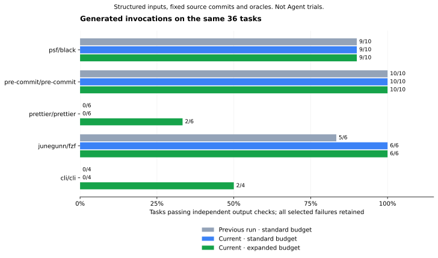

# Generated workflow tasks — 2026-09-22

**29/36 tasks pass with expanded scanning and a 1,024-open-file execution limit.**
The current standard scan passes **25/36**. The historical v14 run passed **24/36**.
All three use the same 36 structured task inputs, source commits and independent output oracles.
**These are generated-invocation tests, not natural-language planning, Agent trials or uplift.**



| Repository | Historical standard | Current standard | Current expanded | Expanded failures retained |
| --- | ---: | ---: | ---: | --- |
| psf/black | 9/10 | 9/10 | 9/10 | Custom exclude callback semantics unknown |
| pre-commit/pre-commit | 10/10 | 10/10 | 10/10 | None |
| prettier/prettier | 0/6 | 0/6 | 2/6 | Four formatting/configuration bindings unsupported |
| junegunn/fzf | 5/6 | 6/6 | 6/6 | None |
| cli/cli | 0/4 | 0/4 | 2/4 | Two completion tasks use an unsupported custom flag wrapper |

New passing workflows preserve fzf input order, classify JavaScript/JSON files with Prettier,
read gh's default Git protocol, and create/list a local gh alias. Each checks output contents;
exit status alone does not pass a task. Standard scanning still excludes 7,352 Prettier files
and one gh test archive, and correctly blocks those bundles. Expanded scanning reads them within
larger bounded limits; it does not suppress scan findings. Both current runs explicitly use
1,024 open files. The product default stays 128.

## Conditions, identities and retained failures

- `standard.json` and `expanded.json` use identical current compiler/runner identities and task
  hashes. The only selected scan profile differs. Each raw task result records execution policy,
  image, source, dependency, binary, procedure and oracle identities.
- The source/oracle hashes match `../2026-09-21-v14/attempt-2.json`. This comparison is not a
  controlled before/after Agent experiment: analysis budget, runtime preparation and the open-file
  allowance differ from the historical run. Do not attribute the full five-task difference solely
  to analyzer quality, or compare generation timings as a speed ranking.
- Runtime: Python 3.12 image `sha256:dcca26b2248580b289b0ed070712e2ccd3447e9ef93e986c2a288c8fcfa445a0`,
  Node 22.14.0, previously pinned fzf build, and gh built from the corpus commit with Go 1.27.1.
  No target code executes on the host. Tasks have no network, no host credentials, read-only
  source, isolated writable work/home, 1 CPU, 768 MiB memory, 64 processes and a 120-second outer limit.
- Expanded admission: 40,000 files, 30,000/workspace, 20,000/non-product role, 16 MiB/file,
  512 MiB overall, 384 MiB/workspace, 256 MiB/non-product role. The independent source-pack limit
  remains 64 MiB. Actual scan limits and coverage are retained per record.
- Six diagnostic attempts, the execution-scan defect, symlink rejection, failed build receipts,
  Prettier `EMFILE`, and three gh build attempts remain in [v16](../2026-09-22-v16/README.md).
  No task, source pin, input or oracle was removed or weakened. These attempts are not pooled.
- `comparison.json` verifies identical task/source inputs, denominators and current identities;
  `manifest.json` is written last. PNG and SVG are generated from those measured JSON files.
- No new Skill Seekers or official-Skill Agent comparison ran. The prior offline comparison
  remains separately versioned. Agent trials, human semantic sign-off and full 200-fact gold remain pending.

## Reproduce

Use the fixed metadata/caches and prepare runtime dependencies before execution. The actual Node
executable must be a regular file, not a symlink. The gh binary must match its successful build
receipt; dependency preparation and failed builds cannot stand in for that receipt.

```bash
python scripts/measure_bound_workflows.py \
  --snapshots /data/snapshots --wheels /data/wheels \
  --work /data/new-expanded-run --output new-expanded.json \
  --image sha256:dcca26b2248580b289b0ed070712e2ccd3447e9ef93e986c2a288c8fcfa445a0 \
  --cross-language benchmark/tasks/cross-language-v1.json \
  --node /path/to/real/node --node-dependencies /data/prettier/node_modules \
  --fzf-binary /data/fzf/program --fzf-build-report benchmark/build-runtime-results.json \
  --gh-binary /data/gh/program \
  --gh-build-report benchmark/workflow-runs/2026-09-22-v16/gh-build-attempt-3.json \
  --scan-profile expanded --open-files 1024 --execute
```

Repeat into fresh work/output paths with `--scan-profile default` for the current standard arm.
If rebuilding gh changes binary bytes, produce a new source/image/command-bound successful build
receipt, retaining the original. For the retained Go builder, `scripts/public_build_runtime.py`'s
`container` helper performs isolated preparation/build: the exact command arrays, image and source
commit are in v16's receipts. Use a fresh writable dependency directory on the data disk; prepare
with network enabled, then build with network disabled. Toolchain/cache preparation is separate
from the frozen task environment and the 36-task pass count.

```bash
python scripts/compare_workflow_measurements.py \
  --baseline benchmark/workflow-runs/2026-09-21-v14/attempt-2.json \
  --default new-standard.json --expanded new-expanded.json --output new-comparison
```

## 中文结果

同一组 36 个任务：历史标准预算 24/36，当前标准预算 25/36，扩大扫描并使用 1,024 文件句柄后
29/36。新通过的任务包括 fzf 保留顺序、Prettier 文件类型检测、gh 本地配置读取与两步别名管理。
这是明确参数输入生成调用后的独立输出验收，不是自然语言目标理解或 Agent 效果提升。

7 个失败仍保留：Black 自定义回调 1 个、Prettier 格式化/配置绑定 4 个、gh 补全参数包装 2 个。
历史成功率与本轮扩大预算结果的差异包含资源及准备条件变化。标准预算不会自动扩大，部分扫描
仍阻断执行；全部原始结果、构建失败、版本身份和复现命令均可查。
