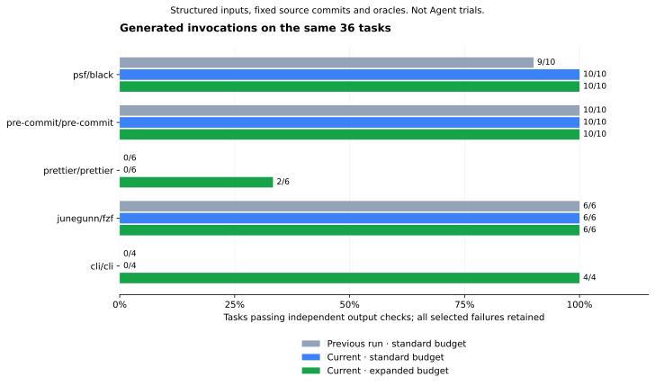

# Generated workflows — source-backed validators

**32/36 tasks pass with expanded scanning, up from 29/36 in v17.** Standard scanning
passes **26/36**, up from 25/36. The same 36 structured inputs, source commits and independent
oracles remain selected. **These are generated-invocation tests, not Agent trials or uplift.**



| Repository | v17 standard | v19 standard | v17 expanded | v19 expanded |
| --- | ---: | ---: | ---: | ---: |
| psf/black | 9/10 | 10/10 | 9/10 | 10/10 |
| pre-commit/pre-commit | 10/10 | 10/10 | 10/10 | 10/10 |
| prettier/prettier | 0/6 | 0/6 | 2/6 | 2/6 |
| junegunn/fzf | 6/6 | 6/6 | 6/6 | 6/6 |
| cli/cli | 0/4 | 0/4 | 2/4 | 4/4 |

## What changed

Three previously blocked tasks now pass their unchanged output checks:

- `black-exclude`: a statically resolved pure Click regex callback validates the supplied pattern;
  the task checks the expected file contents after applying the exclusion.
- `gh-completion-bash` and `gh-completion-zsh`: a structurally verified local Cobra enum wrapper
  provides the shell option's arity and declared choices; the generated command outputs the
  expected completion-script markers.

The implementation uses AST structure and symbol binding, not repository or helper-name allowlists.
Declarations, validators and required-flag markers retain source witnesses. Unknown custom
behavior stays blocked. See the [supported rules and limits](../../../docs/source-validators.md).

## Comparison checks and remaining failures

`version-comparison.json` verifies identical task/source hashes, scan budgets and runner bytes
between the two expanded runs. Runtime contexts match by repository: source inventory, image,
execution policy, wheel/dependency hashes, native binary and worker. All 29 previously executed
tasks also retain identical bound inputs, expected exits and oracles. Three previously blocked
tasks had no runtime result; their new execution is not a repeated prior execution. No passing
task regressed. The comparison does not rank timings or estimate model utility.

All four remaining expanded failures are recorded before execution:

| Task | Unresolved binding |
| --- | --- |
| `prettier-format-json` | Core API parser option forwarded through multiple modules |
| `prettier-format-js` | API option mapped to the stdin-filepath CLI name |
| `prettier-write-js` | Positional file patterns routed through the argument normalizer |
| `prettier-config-js` | Configuration/stdin option path and custom validation semantics |

These require a source-backed JS data-flow model. Relaxing the binder or inserting known
Prettier flags would not establish that model. Standard scans additionally retain the Prettier
and gh scan-budget gates. Defaults stay standard scanning and 128 open files; both measured
arms explicitly use 1,024 open files. Expanded scan and source-pack limits are unchanged from v17.

The [v18 diagnostic run](../2026-09-22-v18/README.md) already reached the same task score but had
a separate old-directory migration defect. It is retained. v19 repeats all tasks and all 45
static snapshots after that fix; diagnostic attempts are never pooled into these denominators.
The earlier preparation, runtime and build failures remain in v14/v16/v17.

## Reproduce

Prepare the existing fixed snapshots, wheel cache, Node dependencies and pinned native builds.
All target execution occurs offline in the existing isolated runner: read-only source, no host
credentials, non-root user, 1 CPU, 768 MiB memory, 64 processes and a 120-second outer limit.

```bash
python scripts/measure_bound_workflows.py \
  --snapshots /data/snapshots --wheels /data/wheels \
  --work /data/new-expanded-run --output new-expanded.json \
  --image sha256:dcca26b2248580b289b0ed070712e2ccd3447e9ef93e986c2a288c8fcfa445a0 \
  --cross-language benchmark/tasks/cross-language-v1.json \
  --node /path/to/real/node --node-dependencies /data/prettier/node_modules \
  --fzf-binary /data/fzf/program --fzf-build-report benchmark/build-runtime-results.json \
  --gh-binary /data/gh/program \
  --gh-build-report benchmark/workflow-runs/2026-09-22-v16/gh-build-attempt-3.json \
  --scan-profile expanded --open-files 1024 --execute
```

Repeat with `--scan-profile default` into fresh paths for `new-standard.json`.
The native executables must match their successful receipts; the Node path must be a regular
file. Dependency/build preparation is separate from task execution. See v17 for retained build
commands and the source-locked gh receipt.

```bash
python scripts/compare_workflow_measurements.py \
  --baseline benchmark/workflow-runs/2026-09-22-v17/standard.json \
  --default new-standard.json --expanded new-expanded.json \
  --previous-expanded benchmark/workflow-runs/2026-09-22-v17/expanded.json \
  --output new-comparison
```

Local validation is recorded in `verification.json`: 398 tests and 12 subtests pass with Docker
and Chromium enabled; Ruff, mypy and seven isolated-wheel checks pass. Windows/Linux CI is
reported separately on the published commit. The manifest is written last. No new model or
official-Skill Agent experiment ran; full semantic review and the 200-fact gold remain open.

## 中文结果

同一组 36 个任务，扩大扫描后的实测从 **29/36 提高到 32/36**，标准扫描从 **25/36 到 26/36**。
新增通过 Black 排除规则、gh Bash/Zsh 补全；没有更换任务、源码、oracle 或扩大本轮资源预算。
版本比较器核对扫描、运行环境和已执行任务的输入，原先绑定失败的任务没有旧运行结果可比。

剩余 4 项均为 Prettier 跨模块参数/位置参数绑定，全部保留。45 个高 Star/挑战/边界快照也重新
完成静态测量。旧目录迁移缺陷及修复前结果单独留档。上述成绩来自结构化输入生成的调用及真实
输出验收，不能替代自然语言目标理解、完整语义准确率、人工签核或 Agent 效果提升实验。
