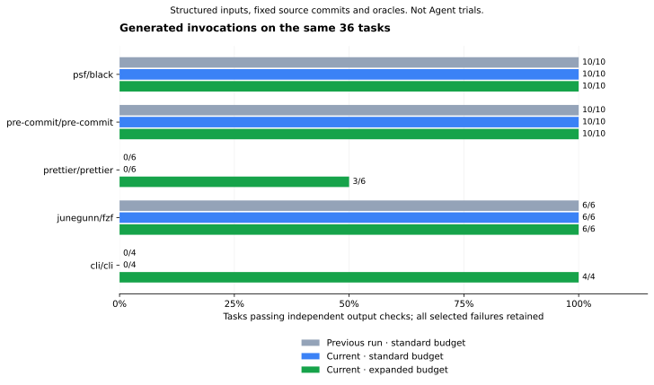

# Unchanged-environment run — JS parser flow

**33/36 expanded tasks pass, versus v19's 32/36.** Standard scanning remains **26/36**.
`version-comparison.json` verifies the same task/source/oracle hashes, scan budgets, runner
and recorded runtime contexts. The newly passing task formats JSON stdin through the generated
Prettier parser option. No previous pass regresses. These are authored-input invocation tests,
not Agent trials, full semantic accuracy or goal-understanding results.

## Three runtime failures remain

All six Prettier workflows now bind to the verified source flow. However, JavaScript stdin,
write-file and supplied-config tasks fail their real output oracles with exit code 2:
the runtime cannot load the OXC parser's native binding. JSON formatting does not exercise that
same native parser. Binding success is not counted as execution success.

The old cache was prepared for musl and contains `@oxc-parser/binding-linux-x64-musl`; the
frozen task image uses glibc. The manifest explicitly declares a GNU/Linux alternative at
version `0.150.0`. A separate preparation downloads that exact package with lifecycle scripts
disabled in a restricted container. `native-dependency-attempt-1.json` records its command,
image, source pin and original inventory hash.

The first cache assembly dereferences existing `.bin` symlinks and is rejected by the additive
inventory check. `native-dependency-assembly-attempt-1.json` retains that failed assembly; it
is not used for task execution. A fresh symlink-preserving copy then keeps all **10,199**
existing regular files unchanged and adds only the binding's three files. Its exact inventory
transition, native package lock and preparation receipt are recorded here. The original cache
and this run remain immutable.

The [separate glibc-compatible run](../2026-09-22-v21-glibc/README.md) repeats the full taskset
after that addition. Its runtime environment differs: any improvement must not be called
same-environment analyzer uplift. Do not pool attempts or replace these three failures.

## Source and validation scope

The compiler replaces disconnected table-name matching with a reachable parser/normalizer
chain. See [implementation limits](../../../docs/javascript-option-flow.md) and the
[Prettier case study](../../../docs/case-studies/prettier.md). The v20 false-negative static
regression is retained separately. No task, source pin, input or oracle is weakened.

Reproduce with the v19 command, changing only work/output paths to fresh directories and
keeping the original Prettier dependency cache. Both arms use 1,024 open files; ordinary
product defaults remain standard scanning and 128 open files. Target execution remains
offline, non-root, resource-limited, without host credentials or writable source.

中文：同环境实测 **32/36 → 33/36**，新增 JSON 格式化通过。其余三个 JavaScript 调用已完成
源码绑定，但真正执行因原生依赖的 libc 不匹配而失败，失败均保留。补齐正确原生模块后的成绩
单独报告，不能把运行环境修复包装成分析器提升或 Agent 效果。
