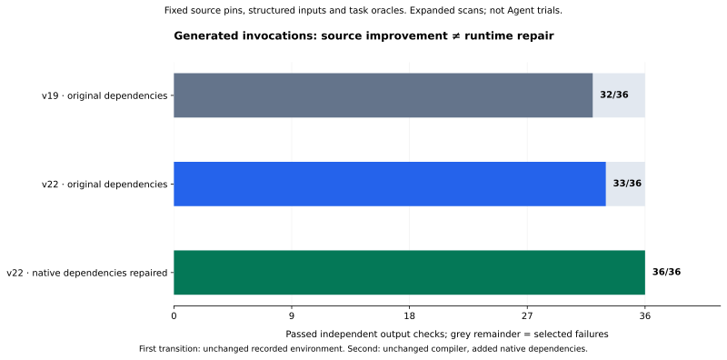

# Generated workflows: 36 tasks, separately measured source and runtime changes

**36/36 expanded-scan tasks pass independent output checks.** Standard scanning passes
**26/36**; all ten budget-gated failures remain in its denominator. This is the same frozen
five-tool taskset, with authored structured inputs, not an Agent trial or full CLI accuracy score.



| Tool | v19 expanded | v22 original dependencies | v22 repaired dependencies | v22 standard, repaired |
| --- | ---: | ---: | ---: | ---: |
| Black | 10/10 | 10/10 | 10/10 | 10/10 |
| pre-commit | 10/10 | 10/10 | 10/10 | 10/10 |
| Prettier | 2/6 | 3/6 | 6/6 | 0/6 |
| fzf | 6/6 | 6/6 | 6/6 | 6/6 |
| GitHub CLI | 4/4 | 4/4 | 4/4 | 0/4 |
| **Total** | **32/36** | **33/36** | **36/36** | **26/36** |

## What users can do now

The generated Prettier workflows format JSON or JavaScript stdin, write a JavaScript file,
apply a supplied configuration and inspect file classification. Bound invocations include the
source-backed parser/stdin/configuration options and positional file input. Exact formatted
output, file content or parsed file-classification checks determine acceptance.
[Case study and generated example](../../../docs/case-studies/prettier.md).

## Two different improvements

1. **32 → 33/36:** the analyzer's bounded option flow replaces disconnected table matching.
   The [original-environment comparison](../2026-09-22-v22/version-comparison.json) verifies
   source/task hashes, scan limits, runner and runtime context identities. JSON formatting is
   the new pass. Three JavaScript tasks bind but fail in the original dependency environment.
2. **33 → 36/36:** adding the source-manifest-declared GNU/Linux bindings for OXC `0.150.0`
   and yuku `0.10.1` repairs that environment. `runtime-repair-comparison.json` verifies the
   unchanged compiler, full bound TaskSpecs, oracles, source, worker and resource limits;
   only the explicit dependency inventory changes. All **10,199** old regular files remain
   byte-identical; the two packages add five files. This is not analyzer uplift.

The first cache assembly was rejected after dereferencing symlinks; the first OXC-only task
attempt still failed on yuku. Preparation receipts, package locks and native preflight remain
in [v21 original](../2026-09-22-v21/README.md) and [v21 OXC-only](../2026-09-22-v21-glibc/README.md).
They are retained evidence, not folded into the final score. Lifecycle scripts are disabled
during separately authorized downloads; tasks themselves run without network access.

v21 also exposes over-permissive AST matches in three adversarial cases. v22 fixes literal
punctuation, array-hole and generator-method matching, then repeats all 45 static snapshots
and all workflow arms. `hardening-comparison.json` retains the same 36/36 observed results
after this correctness repair. No historical report is rewritten.

## Reproduce

Use the saved source pins, caches and digest-pinned image; prepare dependencies separately.
Task execution is non-root, offline, without host credentials, with read-only source, 1 CPU,
768 MiB memory, 64 processes, a 120-second outer limit and **1,024 open files**. Product defaults
remain standard scanning and 128 open files.

```bash
python scripts/measure_bound_workflows.py \
  --snapshots /data/snapshots --wheels /data/wheels \
  --work /data/new-expanded-run --output new-expanded.json \
  --image sha256:dcca26b2248580b289b0ed070712e2ccd3447e9ef93e986c2a288c8fcfa445a0 \
  --cross-language benchmark/tasks/cross-language-v1.json \
  --node /path/to/real/node --node-dependencies /data/prettier/node_modules-complete \
  --fzf-binary /data/fzf/program --fzf-build-report benchmark/build-runtime-results.json \
  --gh-binary /data/gh/program \
  --gh-build-report benchmark/workflow-runs/2026-09-22-v16/gh-build-attempt-3.json \
  --scan-profile expanded --open-files 1024 --execute
```

Repeat with `--scan-profile default` into fresh paths for the standard arm. Repeat expanded
with the original dependency cache for the same-environment arm. The comparison scripts
reject changed tasks/oracles or undeclared runtime files. The graph data in `progress.json`
contains both checked transitions and input hashes; `comparison.json` checks the scan-budget
pair. That pair's v19 baseline is historical and has a different dependency inventory.

## Verification and limits

Local verification: **462 tests and 12 subtests pass**, with real Docker and Chromium checks
enabled and no skips; Ruff and strict mypy pass. Installed-wheel checks and exact compiler
identity are recorded in `verification.json`. Linux/Windows CI is a separate published-commit
gate, not inferred from local testing.

The [static report](../../runs/2026-09-22-upgrade-v22/report.md) still has **20/36 Core STATIC_READY**,
**24/40 selected facts** and **13/30 static task prerequisites**. The 36 tasks do not establish
complete software semantics, unseen-repository generalization, 200-fact gold acceptance,
native client loading or Agent utility. The same five snapshots previously ran through
[Skill Seekers 3.9.0 offline generation](../2026-09-21-v14/README.md); that is not a task-quality
ranking. Full U00–U22 acceptance remains open.

中文：扩大扫描且补齐依赖后 **36/36**，标准扫描 **26/36**。同环境分析改进为 **32→33**，
原生依赖修复为 **33→36**，分别核验。所有失败、尝试和旧指标保留；这不是 Agent 提升或通用准确率。
