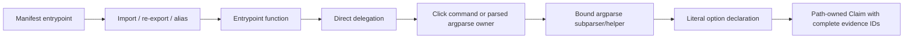

# Python entrypoint graph / Python 入口调用链

The Python analyzer now follows a bounded static path from a manifest entrypoint to an option
declaration. This is the first part of U08, not a complete Python command graph.

Python 分析器现在能沿清单入口、导入/别名和直接调用追踪到选项声明，并把整条链保存为证据。
这是 U08 的一部分；动态注册、完整参数语义和真实任务验证尚未完成。

## Implemented boundary

- PEP 621, Poetry and `setup.cfg` entries use the same graph implementation and shared IR.
- Repository-local modules resolve only from scanner-admitted root or `src/` files. Absolute
  imports, package-relative re-exports and simple module-level aliases retain each source hop.
- Direct zero-argument calls in an expression, assignment or return can delegate to another
  statically resolved function. Calls inside lambdas, comprehensions, conditional expressions,
  unknown callbacks and control-flow blocks do not supply delegated option facts.
- Click options require a recognized command/group decorator and known decorators. Literal dual
  declarations such as `--fast/--safe` become two explicit names. Implicit help/version options,
  framework defaults and runtime behavior are not inferred. Literal parameter keywords and recognized
  built-in types are retained as explicit declarations in IR 1.4; missing/dynamic values stay unknown. See the
  [official Click boolean-option contract](https://click.palletsprojects.com/en/stable/options/#boolean).
- argparse options require a bound root parser that is parsed on the reachable path. Argument groups
  retain their parent's owner. Literal `add_parser` calls form bounded child paths, including nested
  children; child flags remain on their own path and never become root flags. Direct calls to a
  statically resolved helper can bind its parser parameter and preserve the call evidence. Parser
  instances on the same line remain distinct. Unknown parser keyword expansion, nonstandard prefixes
  excluding `-`, aliases, `parents`, parser-class overrides or dynamic names do not supply facts.
  Registrations after the first parse do not supply facts for that invocation; invalid group parse
  methods and declarations containing unresolved option aliases are excluded.
- Discovery IR 1.4 represents a command as a `CommandSpec`, a child as `supports_subcommand`, and
  an option with its exact `command_path`. Parent declaration evidence is required for every child
  and child option. Portable/client documents group options by invocation path.
- Each Claim references the manifest, resolved symbols, import/alias/call hops and declaration.
  Every evidence location carries the scanner's byte hash and available commit/blob identity.

Repository content is parsed, never imported or executed. Graph limits are 64 parsed modules,
128 visited functions and depth 12 per entrypoint. Exhausting a limit suppresses option output
for that entrypoint and records a diagnostic. Duplicate module paths, unresolved bindings,
import/call cycles, wildcard imports and multiple CLI delegates are diagnosed rather than guessed.
The snapshot's broader scan scope remains an independent readiness gate.

## Deliberate gaps

This implementation does not model Python's complete import/runtime semantics. Package initializer
side effects, arbitrary monkey-patching, callbacks, descriptors and dynamic dependencies remain
outside its static guarantee. A source-supported declaration does not prove successful execution.

Local imports inside functions, parser factories with uncertain configuration, Click subcommand
registration/inheritance, Typer application registration, custom parsers and framework plugins need
later graph work. The current helper binding accepts only direct calls with complete non-variadic
arguments. Unsupported annotations or decorators do not create executable facts. Module-level
`setup.py` execution remains prohibited.

Attribute access after `from package import object` is unresolved: the object is not assumed to be
a same-named submodule. Importing only a parent package likewise does not establish that its child
module was loaded. Explicit module imports and direct symbol re-exports are supported. A preliminary
v9 run is retained with a known-defect qualification after extra negative probes exposed these cases.

The pinned pre-commit source now exercises helper-created subparsers: 16 static child paths and 108
scoped options are retained, including `pre-commit run --all-files` separately from
`pre-commit try-repo --all-files`. HTTPie's import inside a `try` block remains intentionally unresolved.
Full IR v2, independent upstream authentication, human semantic review and Agent A/B remain open.

## Verification

`tests/test_python_graph.py` and `tests/test_command_graph.py` exercise cross-file evidence chains,
re-exports, alias hops, dual flags, parser ownership, groups, nested subcommands, helper parameters,
ambiguous/dynamic registration, limits, cycles, scope rewriting and source drift. An import-side-effect
marker checks that analysis does not execute target code. These controlled tests are not public task scores.

The fixed-corpus measurement and its identity are recorded separately under the versioned benchmark
run. Previous runs are preserved; new facts remain semantically unreviewed unless specifically
evaluated against the selected ground truth.
