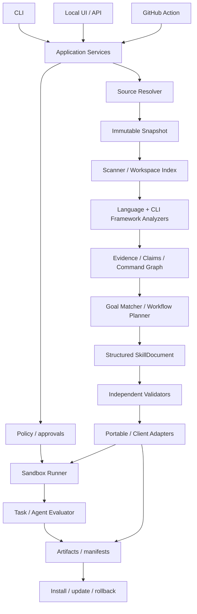

# Repo-to-Skill 全量升级方案

状态：实施中；当前完成 P0 可信度修复的第一批，并保留未验证项。日期：2026-09-15。

基线代码：`cd20fa7c9fa487191f2fbe5866e6fbb3ece6a00e`。
基线报告：[Public Repo Benchmark 1.0](../benchmark/report.md)。
本文件定义下一阶段的产品、架构、工作包、验收和发布顺序；其中指标均为拟定门槛，不是已测成绩。

## 1. 升级目标与范围

把现有静态原型升级为能够识别正式 CLI、生成目标相关工作流、拒绝无证据事实、在隔离环境验证并安全安装更新的 Repo → Skill 编译器。

核心承诺是：每个可执行事实有可核对的来源，每个被声明支持的工作流有明确边界，每次质量声明绑定具体版本与评测范围。

| 发布层级 | 范围 | 不作为该层级交付承诺 |
| --- | --- | --- |
| 稳定化版本 | 当前 Python / JS/TS / Go CLI，修复可信度缺陷 | 深层跨文件提取、效果提升 |
| CLI Public Beta | 三类语言 CLI 的主要框架、完整本地流程、受控运行验证；Rust challenge 如实降级 | 任意 CLI、任意 Rust 程序、企业托管 |
| CLI 1.0 | 稳定协议、可复现任务评测、安全安装更新、版本支持矩阵 | “所有仓库都能生成 Skill” |
| 扩展版本 | Rust CLI、HTTP/OpenAPI、库 API、框架和贡献指南 | 用 CLI 指标替代这些领域的独立评测 |
| Hosted GA | 私有仓库授权、团队策略、隔离租户、配额、审计、持续同步 | 复用本地开发沙箱作为多租户安全边界 |

默认静态分析不执行仓库代码；默认不向外部模型发送源码。执行、依赖安装、网络和外部模型访问分别受策略约束。用户在产品中授予的有效范围可以复用，不对同一动作重复询问。

继续采用单一领域模型和多个薄适配器。保留已经验证的快照、内容寻址、能力增量和只读投影基础；按模块替换缺陷，不整仓重写，不为不同客户端复制提取逻辑。

## 2. 已知基线与必须解释的缺口

| 项目 | 当前事实 | 升级含义 |
| --- | --- | --- |
| 公共源码 | 45 个固定 SHA 快照；36 Core、6 Rust challenge、3 secondary | 保留全部失败和分层；不能靠换小仓库提高指标 |
| Core 结果 | 25 STATIC_READY、4 REVIEW_REQUIRED、7 UNSUITABLE | STATIC_READY 仅为旧内部校验结果 |
| 事实召回 | 10 个仓库，40 个选定事实，覆盖 9 个 | 22.5% 是选定样本召回，不能推成完整 CLI 召回 |
| 任务前提 | 30 个任务中 1 个覆盖全部选定静态前提 | 不等于 1/30 真实执行成功 |
| 事实审计 | 91 条生成事实均可追溯；4 个错误命令名；87 条未全面语义审查 | 可追溯与正确性必须分开评估 |
| 运行 | 4 个项目共 10 个功能用例通过，另有 help/version 检查 | 尚未证明 Skill 帮助 Agent 完成任务 |
| 外部验证 | 无人工签核、无 Agent A/B 提升结论 | 保留 unknown，不推算零幻觉 |
| 产品 | CLI + 本地只读 UI；运行工具在 scripts 中 | 需要统一编排与可操作 UI |

本轮审查还复现了四项缺陷：

1. 对生成 Skill 追加不存在的命令，独立校验仍返回 STATIC_READY，安装预览也通过。
2. 普通 `database.option(...)` 调用被当作 CLI 参数，缺少框架绑定和调用对象识别。
3. 完全不相关的目标仍生成 Procedure，并被写入 Skill 用途描述。
4. CRLF 文件被归一化后计算 Git blob，结果与原始 Git 对象不一致。

主要位置：[generator.py](../src/r2s/generator.py)、[analyzers.py](../src/r2s/analyzers.py)、[planner.py](../src/r2s/planner.py)、[scanner.py](../src/r2s/scanner.py)。这四项与 Go module 后缀、测试辅助程序误报共同构成第一批回归任务。

## 3. 顶级项目的可借鉴部分

这里比较可核实的工程机制，不宣称其他项目在同一 corpus 上有更高准确率。采用前固定具体版本、许可证和兼容性测试；不直接执行外部仓库中的安装建议。

| 项目 | 借鉴内容 | 边界 |
| --- | --- | --- |
| [Agent Skills](https://agentskills.io/specification) | 标准目录、frontmatter、渐进加载、规范一致性测试 | 格式合规不证明内容正确；参考库自身定位为演示实现 |
| [Skill Seekers](https://github.com/yusufkaraaslan/Skill_Seekers) | 创建、配置、打包、分发的完整用户流程 | 本项目仍先专注可验证 CLI，不一次引入全部来源类型 |
| [Repomix](https://repomix.com/guide/agent-skills-generation) | 仓库筛选、引用组织、可用的生成入口 | 其 Skill 输出主要服务代码库参考且标为实验性；不与执行准确率混用 |
| [Repomix 安全模型](https://repomix.com/guide/security) | Secretlint、忽略规则、远程配置不可信 | 扫描器不能把仓库配置当可执行宿主配置 |
| [Vercel Skills](https://github.com/vercel-labs/skills) | 多客户端安装、更新、移除、能力矩阵 | 可作为可选分发桥；不成为第二套分析引擎 |
| [Anthropic skill-creator](https://github.com/anthropics/skills/blob/main/skills/skill-creator/SKILL.md) | 有/无 Skill 对照、版本对照、输出审查 | 把评测设计作为参考，不继承外部文档中的运行指令 |
| [SWE-bench](https://www.swebench.com/SWE-bench/guides/quickstart/) | 任务定义、执行环境、gold 校验、可重放日志 | 复用评测思想，不套用其任务类型或容器权限 |
| [uv](https://docs.astral.sh/uv/getting-started/installation/) | 锁定工具链、安装体验、发布与版本管理 | 不因性能口号贸然重写 Python 核心 |

同名研究 [Repo-To-Skill](https://arxiv.org/abs/2609.02749) 面向 ML 研究技能蒸馏，属于邻近方向。项目介绍要说明本项目的作者、范围和关系，避免读者混淆；其论文指标不进入本项目成绩。

## 4. 目标架构与技术决策



| 层 | 决策 |
| --- | --- |
| 核心 | Python 3.12+ 模块化单体；纯领域和编译函数不访问网络 |
| 数据 | 保留内部 dataclass；在 JSON/API 边界用 Pydantic v2 严格模型；从同一契约导出完整 JSON Schema，避免维护互相漂移的两份定义 |
| CLI | 第一阶段保留 argparse 的命令兼容；是否换 Typer 以实际交互需求决定，不单为更换框架开重写任务 |
| Python 提取 | 标准 AST + import/alias 绑定 + CLI 框架语义适配 |
| JS/TS 提取 | 固定版本的 tree-sitter 前端，框架规则消费统一符号索引；必要的编译器辅助程序独立版本化 |
| Go 提取 | 小型 `go/parser` / `go/ast` 辅助程序，只解析输入文件；类型分析另设受控能力，不以宿主 `go list` 偷跑目标环境 |
| 输出 | 先构建 SkillDocument，再用版本化 Jinja2 模板确定性渲染；模板无任意用户扩展执行 |
| 本地运行 | SQLite WAL + 不可变文件目录 + 有界子进程执行器；先不引入 Redis/消息队列 |
| 本地 API | FastAPI 作为可选 `ui` extra，应用服务可在无 HTTP 环境使用 |
| UI | TypeScript + Vite 的轻量界面，编译资源进入 wheel；用户安装和使用不需要 Node |
| 本地沙箱 | 明确支持的 Linux 容器执行器，rootless 优先；平台能力检测失败时保持未验证 |
| 托管 | 复用领域层，再替换 PostgreSQL、对象存储、任务队列和更强隔离执行器 |

目标模块边界建议：`contracts/`、`application/`、`sources/`、`analysis/`、`planning/`、`documents/`、`validation/`、`execution/`、`evaluation/`、`distribution/`、`api/`。按工作包逐步提取当前文件，过渡期保留 `r2s.core` 等兼容导出；不为目录整齐一次搬迁所有文件。

## 5. IR v2：把“出现过”与“支持某用途”分开

### 5.1 必须增加的对象

| 对象 | 必须表达的内容 |
| --- | --- |
| RepositorySnapshot | locator、精确 commit、原始内容哈希、分析树哈希、获取与过滤策略版本、完整性边界 |
| Workspace | package/module 根、父子关系、语言、产品/开发/测试/示例/未知角色 |
| Evidence | 原始事实、精确字节范围和行号、路径、SHA、提取器版本、来源种类与可信范围；敏感值不入库 |
| Claim | 规范化事实、证据列表、推导规则与版本、支持/冲突/未知状态、命令或 API 所有者 |
| CommandSpec | 正式命令、别名、子命令路径、参数、选项、默认值、环境变量、配置、版本与平台条件 |
| Capability | 用户能完成的动作、关联 command/workspace、前置条件、可观察结果、已知边界 |
| Procedure | 类型化步骤、参数绑定、输入输出、风险和验证断言；不使用任意 shell 字符串充当全部执行模型 |
| SkillDocument | 触发条件、事实块、说明块、命令示例、引用及 claim ID 映射 |
| ValidationReport | 各独立校验项、输入摘要、工具版本、失败与未知、作用范围 |
| ExecutionSpec / Approval | argv、cwd、挂载、环境允许列表、网络、配额、超时、授权范围和输入摘要 |
| TaskSpec / EvalReport | 版本、样本、oracle、环境、模型配置、轨迹、结果、统计方法 |
| BundleManifest / InstallReceipt | 全文件清单、摘要、来源、生成版本、客户端、授权/签名信息、安装版本与位置 |

参数必须区分 flag、位置参数、取值占位、用户运行时输入、环境配置；`--config` 属于哪个子命令不能靠字符串相等判断。类型、默认值、互斥和副作用证据不足时填 unknown，不补猜测。

### 5.2 三类身份

- `raw_content_sha256`：实际输入字节，禁止隐式换行归一化。
- `git_blob_oid`：经 Git 对象或原始 blob 计算验证的对象 ID，并记录 SHA-1/SHA-256 算法；工作树和仓库对象不一致时分别保存。
- `analysis_digest`：过滤规则、规范化策略和分析输入的摘要，只用于分析缓存，不冒充 Git 标识。

解析器使用解码/规范化副本时保存到原始字节的范围映射。CRLF、UTF-8 BOM、文件名大小写及不同 Git object format 都加入测试。

### 5.3 契约与版本

- Schema 对数组元素和所有嵌套对象定义字段、类型、枚举、长度、引用及路径约束；当前只有顶层约束的 schema 不能承担信任边界。
- 外部输入不做字符串到布尔值等隐式转换；未知协议主版本明确拒绝，扩展字段进入命名空间。
- ID 计算包含 schema、snapshot、提取器、策略和实际 IR 摘要；Compilation ID 额外包含 Planner、模板、渲染器和 Client Profile 版本。
- 记录完整摘要，短 ID 仅用于显示；入库时检查短 ID 碰撞。
- 原始 Evidence 与派生 Claim 分离；启发式置信度不得伪装成校准概率。

## 6. P0：可信度修复工作包

| ID | 修复 | 可复核验收 |
| --- | --- | --- |
| T01 | 产物与证据绑定 | 改写正文、引用、脚本、manifest 或新增文件后，原有验证结论失效；安装前完整复核 |
| T02 | Python 调用绑定 | 普通 `.option` 方法不产生 CLI Claim；正确支持 import alias、装饰器和 parser 归属；不确定调用只产候选 |
| T03 | Go 正式可执行名 | 修复 gum/goreleaser/direnv/yq 的 v2/v4 误报；module 名只作候选，不保证去后缀就是真命令 |
| T04 | 入口角色 | npm/pnpm/bat 的测试程序不进入产品 Skill；开发工具可显式选择；真实命令不能仅因目录含 test 被误删 |
| T05 | 目标匹配 | 不相关目标返回 NEEDS_INPUT 或明确不支持；混合/中文目标可解释选择依据；不把用户目标直接当用途事实 |
| T06 | Git 身份 | 原始 CRLF、LF、BOM、dirty tree、Git 两种对象算法用例与真实对象核对一致 |
| T07 | 验证器边界 | 恶意 YAML、重复 key、错误类型、超大文件、路径穿越、符号链接、Windows 路径/大小写冲突均明确失败 |
| T08 | 历史基线 | 将现有报告和工具版本固定为 legacy baseline；新结果独立运行 ID；修复不改写旧成绩 |

T01 的实现必须分三层：

1. 格式校验：安全 YAML、目录、引用和客户端规范。
2. 内部一致性：从类型化 SkillDocument 确定性重建事实段、argv、引用和正文，检查文件集合与字节摘要。用户改写内容需重新编译/审查，不能沿用旧验证状态。
3. 外部依据：证据重新对照固定源码；从可信安装 receipt、发布签名或独立保存的 manifest 绑定产物。只有随包自带哈希时标记为“自洽，来源未独立认证”。

单纯补一个随包哈希无法防止攻击者同时重写正文和哈希。哈希也无法判断源代码中的某个字符串是否真的定义了 CLI 行为。不得把这两类问题合并为一个“安全通过”。

第一阶段支持严格确定性模板，事实块必须来自 Claim。LLM 后续仅能提交结构化候选说明和已有 claim ID；自由文本新增的能力陈述不能直接进入已验证产物。任意第三方 Skill 可做规范审查，但没有源码与可信编译记录时只能输出 REVIEW_REQUIRED。

## 7. Scanner 与跨语言提取升级

### 7.1 Scanner / Resolver

- 合并产品与 benchmark 的快照契约，复用同一校验逻辑；保持下载操作位于 source adapter，不进入纯分析器。
- 使用 Git 文件清单、workspace manifest 和显式 include/exclude 构建候选输入；`.gitignore` 是相关性信息，不是安全许可，已跟踪正式源码不能被盲目排除。
- 按 workspace 预算分析并返回局部结果与 `SCAN_INCOMPLETE`；保留总文件、字节、CPU、内存和时间上限。不能直接无限增大 10,000 文件阈值。
- 对未扫描区域明确列出未知能力范围，局部完成不能升级为整个仓库支持。
- 统一 archive、Git、缓存的安全策略：路径穿越、链接、重复名、特殊文件、大小写/Unicode 冲突、压缩及展开限额、子模块和 LFS 边界。
- 下载使用临时目录、摘要与原子提交；中断恢复验证已有块/文件，磁盘空间不足提前退出；任务清理仅删除自身临时目录。
- 内容级秘密扫描使用固定版本规则，对证据、输出、日志分别检查；只记录脱敏类别和位置，不序列化真实秘密。
- 性能记录冷/热缓存 wall time、峰值 RSS、磁盘读写、缓存命中和最慢阶段；在固定机器与完整失败集合上比较。

### 7.2 分析器支持矩阵

| 层 | Python | JS/TS | Go | Rust |
| --- | --- | --- | --- | --- |
| 来源/入口 | PEP 621、Poetry、setup.cfg、模块入口 | package bin、workspace、包装和委托入口 | go.mod/go.work、main package、发布二进制映射 | Cargo bins/examples/workspace，先分类 |
| 第一批框架 | argparse、Click、Typer | Commander、Yargs、CAC | 标准 flag、pflag、Cobra | CLI Beta 保持 challenge |
| 后续框架 | optparse、Cleo、项目特定 parser（如 yt-dlp） | oclif、clipanion、自定义 parser | Kong、urfave/cli、自定义 parser | Clap derive/builder，独立版本发布 |
| 语义目标 | parser/group/subparser、别名、参数绑定 | option/command 调用链、跨文件导入 | AddCommand、PersistentFlags、别名、继承 | attrs、子命令 enum、feature/cfg 条件 |
| 边界 | 动态注册与自定义装饰器未知 | 动态执行/代码生成未知 | build tags/cgo/动态注册按支持矩阵 | 宏展开未知，不能凭 Cargo bin 宣称任务支持 |

语言解析前端负责语法；框架适配器负责命令语义；项目特例是最后手段。优先通用规则，每个特例必须版本化、有源码证据与多版本测试，并在报告标记，不能静默按仓库名写答案。

黄金仓库首批 gh、Prettier、black、pre-commit、fzf；同时把 pytest/Click 项目纳入框架正反例。yt-dlp、Poetry、ESLint、Hugo、webpack 保持完整 benchmark 和明确失败清单，不因难支持移出。Prettier/ESLint/fzf 的自定义 CLI 架构需要独立处理，不能把支持 Commander/Cobra 当作自动支持它们。

## 8. Planner、工作流与生成质量

Planner 返回结构化结果：`MATCHED`、`AMBIGUOUS`、`NO_MATCH`、`UNSUPPORTED`，以及选择原因、候选、缺失事实、可回答的范围。显式能力 ID 优先于自然语言推断；命令名命中只是信号，不是相关性的全部。

工作流模板按操作类型组织，例如格式化/检查、查询 JSON、构建、过滤、配置、安装 hook。模板中的具体命令、选项、默认路径和环境变量仍必须来自当前来源的事实；没有证据的部分显示为缺失输入。

一个 Skill 对应一个连贯工作流或紧密相关操作组，避免每个二进制自动拆一个、也避免整个 monorepo 塞一个。引用以操作主题分组，包含来源链接、支持版本、输入输出与错误处理。

生成内容的最低要求：

- 什么任务应该触发，什么任务不在范围内。
- 版本、环境、所需用户输入；使用类型化占位输入而非虚构值。
- 至少一个有证据且经相应检查的调用路径；参数选择依据与副作用。
- 成功的可观察结果，以及失败时下一步；未知错误不得写成已覆盖。
- 触发描述同时测试漏触发和误触发；中文/英文用户目标均纳入固定测试集。

LLM 为可选辅助层：默认关闭、记录模型/提示词/输入摘要/响应、缓存结果；仅聚类、命名、提出说明候选，不成为事实来源。启用外部模型前基于已知仓库可见性和明确授权策略检查可发送范围；本地路径默认可见性未知，不能等同于公共仓库。外部模型拒绝或不可用不影响确定性静态路径。

## 9. 验证与发布状态

状态拆成三个正交维度，所有 UI/API 都读取同一结果：

| 维度 | 候选值 | 说明 |
| --- | --- | --- |
| 作业生命周期 | QUEUED / RUNNING / WAITING_INPUT / WAITING_APPROVAL / SUCCEEDED / FAILED / CANCELLED | 表示作业执行，不表示产物质量 |
| 产物处置 | AVAILABLE / NEEDS_INPUT / MAP_ONLY / REVIEW_REQUIRED / UNSUITABLE | 解释当前能交付什么 |
| 检查结论 | PASS / FAIL / UNKNOWN / NOT_APPLICABLE，按 schema/provenance/semantic/runtime/effect/client 分项 | 保存范围、版本和原因 |

严格规则：

- `STATIC_READY` 为兼容名称，新界面显示“静态检查通过”，不自动变成 READY。
- `RUNTIME_READY` 必须绑定具体 bundle、平台、工具链与通过的 workflow，不代表跨平台或完整 CLI。
- `READY` 是发布策略计算的派生状态，不手动设置：声明范围内规范与客户端检查全通过、事实溯源全覆盖、无未解决 high/critical、声明 quickstart 全通过、适用语义审查完成、效果与平台门槛满足。
- 未验证是 UNKNOWN；部分成功不能覆盖失败；不支持语言和测试辅助程序误报单独显示。
- 效果是指定任务集/模型/版本的结果。某一个 Skill 的通过不能继承另一个 Skill 或整个 corpus 的平均值。

初期接入 skills-ref 作为规范差异检测，固定其 commit 并保留内部强校验；它不是生产安全认证。客户端格式规范固定为 Profile 版本；实际支持必须有客户端发现、加载和调用测试。

## 10. 沙箱、依赖与执行策略

先把现有 Docker 实测拆成可复用执行器，保留当前隔离设置，并补齐可重放性、准入和故障恢复。

| 阶段 | 默认网络 | 运行内容 | 持有凭据 |
| --- | --- | --- | --- |
| 获取源码 | 限 GitHub/允许镜像 | 下载器 | 仅下载所需凭据，独立进程 |
| 获取依赖 | 按锁定源允许 | 安装器/下载器；npm lifecycle 默认关 | 仅依赖源所需最小范围，单独授权 |
| 构建目标 | 关闭 | 目标构建代码与必要 hooks | 无宿主凭据 |
| 运行任务 | 关闭 | 固定源码/产物 + 合成输入或已授权 fixture | 无宿主凭据 |
| 网络集成测试 | 明确允许列表 | 独立网络任务 | 独立测试账号，日志脱敏，不使用下载 token |

Python sdist、PEP 517 backend、npm lifecycle、Go build/cgo 等都视为可能执行任意代码。下载依赖授权与执行 hooks 权限不同；镜像缺失、依赖缺失或不支持隔离时返回具体阻塞，不退回宿主执行。

镜像以可获取的 repository digest 固定，同时记录实际 image ID、架构；依赖锁文件本体及 artifact hashes 随 replay 包保存。镜像标签与锁文件哈希单独存在不足以复现。

沙箱挂载只读源码和只读依赖输入，写入使用一次性目录；禁止 Docker socket、宿主 HOME、SSH、云凭据等挂载；默认非 root、cap drop、no-new-privileges、seccomp、CPU/内存/pids/文件大小/输出/时间限额。取消和超时必须清理本任务容器及子进程。

Linux rootless 为首个明确支持环境。Windows/macOS 通过受支持 VM/容器后端实测后才列为运行支持；两平台 Python CI 不能代替运行支持。Hosted 阶段为任意不可信代码选用专用隔离主机与 gVisor/microVM 等更强边界，进行独立攻击测试后上线。

ExecutionSpec 默认 preview。`--execute` 表示调用者请求执行，策略引擎复核已有授权是否覆盖具体输入摘要、依赖、网络、目标路径和资源预算；不能由 Skill 内的文字授予权限。普通静态扫描/生成不增加多余批准步骤。

## 11. Benchmark 2.0 与效果评测

### 11.1 样本保持与升级

- 固定现有 45 个快照为 baseline corpus；36 个 Core 继续作为主要分母；stars 使用历史 metadata，不在渲染时刷新。
- 样本层次不变：Tier A 至少 10、Tier B 至少 20；6 Rust challenge 和 3 secondary 分开报告。公开解释 rich/click 等 CLI 框架/模块型入口样本的适用性，不为提高成功率移除失败。
- 同时报告全部 Core、声明支持的语言/框架切片、challenge 安全结果；不能将不支持语言从全体 headline 分母消失。
- 若新版本 corpus 需要调整，创建版本与变更理由，旧集合继续对照；新 stars 快照不改旧记录。
- 先在 10 个 ground-truth 仓库补到至少 200 条分层选定事实，冻结后再调规则；避免全部取最容易的命令名，覆盖嵌套命令、默认值、别名、负例与错误归属。
- 现有 40 条事实保留用于历史比较，新增集合另报。独立人工审查至少 10 个仓库的标注；没有审查人时保持 agent-curated 状态。
- 单独建立开发集与冻结验证集；至少 5 个验证仓库不用于当前轮规则调优，公开仓库无法保证模型无预训练接触，只声明工程调优隔离。

### 11.2 TaskSpec 与 oracle

30 个任务逐个落地：task ID、repo SHA、环境 digest、初始输入、用户目标、允许工具/网络、时间与 token 上限、期望产物、断言、清理规则、任务依赖。每个任务先验证 gold 解法确实能通过。

本地文件操作、Git 临时仓库和回放 HTTP 服务优先；模拟接口只证明被模拟范围。真实联网任务另列，授权的测试账号与沙箱仓库执行；包含 issue/PR 写操作的任务不能默认发往真实项目。

pytest/自定义断言检查文件、JSON、退出码与副作用，不能仅检查 stdout 包含一个单词。对故意写错输出、漏执行步骤和越权副作用做 oracle 负测试。任务前提覆盖与执行成绩分开存。

### 11.3 对照实验

| 实验臂 | 输入 |
| --- | --- |
| A | 同一 Agent 与用户任务，无 Skill |
| B | 同一设置，加入自动生成 Skill |
| C | 有官方 Skill 的项目加入固定版本官方 Skill |
| D | 用固定版本 Repomix/其他工具生成的参考产物，作为可选竞争基线 |

所有实验臂共享源码可见性、工具权限、环境、任务和预算；Skill 的增量 token 算入成本。对需要源码访问的任务，各臂获得相同访问权，不人为削弱 baseline。顺序随机化，隔离会话/缓存污染；同任务至少 3 次试跑诊断，最终 5 次重复，不能只挑最佳 run。

固定 30 任务 × 5 次 × 2 实验臂，至少 300 次正式运行；官方臂按可用任务增加。先做 10 次 pilot 测实际费用，再按请求数、真实 token 单价和预算上限决定批次，不能事先承诺免费完成或杜撰费用。

主要指标预注册为任务通过率，secondary 为错误执行事实、越权副作用、完成时间和 token。重复运行不是独立的新任务；区间与显著性按任务/仓库配对聚类计算，保留小样本限制。人工/模型盲评只补充语义判断，不替代可执行断言。

原始产品门槛保留：相同条件下提升至少 15 个百分点；或质量非劣时中位时间/token 至少降低 25%。质量非劣界限预设为 5 个百分点、报告 95% 区间；主要提升还要求配对区间排除零。样本不足或区间不确定时不标记效果已验证。分仓库、框架、任务类型公开结果，不能只报聚合胜率。

效果通过先限定在被测任务与支持矩阵，不能传播为任意仓库通用提升。以原生 CLI 已经成熟为理由得到的 10/10 功能结果不能算 Skill 增益。

### 11.4 统计与工件完整性

- `supported_repository_coverage` 必须绑定明确支持条件；保留旧 `static_generation_coverage` 名称和定义。Star weighted = 通过该条件的 Core stars / 全部选定 Core stars，始终说明不是用户覆盖率。
- 事实 precision 需要对生成事实逐条判定正确/错误/无法判断，报告已审查比例；召回在冻结 gold 上计算，不能把 87 条未知当正确。
- 子命令覆盖评测器必须支持 command path，不能像旧 `covered()` 一样只识别 command/option；加入评测器自身正负例。
- 每个 worker 开始时记录源码、编译器、提取器、策略和任务摘要，结束时确认；汇总验证这些已记录字段，不能在 collect 时以当前代码摘要为旧结果补签。
- 固定 `benchmark/runs/<run-id>/` 和 `manifest.json`；报告只消费显式 run ID。禁止不同快照的静态、功能与官方对照 JSON 混用。
- 记录 fetch、scan、generate、validate、deps、build、runtime、oracle、model 各阶段失败；公开分母与缺失，不通过重试隐藏失败率。

### 11.5 GitHub CLI 专项

保留现有 1/5 与 4/5 的“选定事实出现情况”，不得改名为完整命令覆盖。新增完整工作流对照、未知/错误事实审查、体积/token、运行任务、两次真实 upstream commit 更新实验；每版都固定官方 Skill、源码和工具链，解释官方文本未嵌 SHA 与无版本历史的区别。

## 12. UI：从查看器升级为任务工作台

目标主路径：粘贴仓库或选择本地目录 → 确认固定版本与识别结果 → 选择目标/能力 → 生成 → 查看验证与缺口 → 导出/安装。静态路径少步骤；需要执行或外传时才显示相关选择。

| 页面 | 主要交互 | 验收 |
| --- | --- | --- |
| 开始 | repo/ref/目标/客户端；示例任务；默认静态策略 | 新用户能看出下一步；没有凭空预填成功结果 |
| 分析结果 | workspace、正式入口、候选、未知；能力多选 | 测试程序默认不选；用户能理解排除原因 |
| 生成预览 | Skill 正文、命令预览、引用、缺失输入、来源跳转 | 任何事实可追到对应版本的源码 |
| 验证 | 规范/语义/运行/效果/客户端独立状态 | 未运行清晰显示；失败给可执行的下一步 |
| 安装与更新 | 范围/客户端/变更预览/冲突/回滚 | 仅更新本工具管理的文件；不覆盖用户修改 |
| 历史与比较 | stage 事件、取消/重试、版本差异、下载报告 | 刷新/重连后状态与 CLI 相同 |

API 候选：

```text
POST /api/runs
GET  /api/runs/{id}
GET  /api/runs/{id}/events
GET  /api/runs/{id}/capabilities
POST /api/runs/{id}/plans
POST /api/runs/{id}/compilations
POST /api/runs/{id}/executions
POST /api/approvals/{id}/decisions
POST /api/runs/{id}/cancel
GET  /api/artifacts/{id}
POST /api/installations
POST /api/installations/{id}/updates
POST /api/installations/{id}/rollback
```

写请求使用幂等键；状态只能由 application service 更新；SSE 事件有序号并可恢复；取消/重试只影响所属任务。事件写入与状态更新保持事务一致，不把 log 文本解析成状态。

本地 UI 从只读变为可写前必须补 Host/Origin 验证、随机会话能力、CSRF、防 DNS rebinding、请求体/频率限制、受控源路径与安装路径。Loopback 不是身份认证。后端只接受路径或 artifact ID，不接受任意 shell 命令；不提供任意宿主文件读取。前端禁用 innerHTML 处理仓库内容，打包脚本收紧 CSP。

界面提供中英切换、键盘操作、合理焦点顺序、空/错误/加载/取消状态、窄屏可用和语义化标签。第一版沿用当前风格，不为复杂组件库增加大量依赖。浏览器测试必须覆盖完整静态流程和伪造跨站写请求。

可用性拟定门槛：5 名首次接触项目的使用者，在已有依赖和可用网络下无需开发者指导完成静态导出；单独记录任务耗时和阻塞。没有真实参与者时只报告自动化浏览器测试，不称为用户验证。

## 13. CLI、客户端与安装更新

拟定命令，保持现有参数兼容；新增命令只有实现后才出现在首页可用能力表：

```text
r2s inspect <repo> --ref <ref> --json
r2s plan <source> --goal <goal>
r2s build <source> --goal <goal> --target portable|codex|claude|cursor
r2s validate <bundle> --level format|provenance|semantic
r2s verify <bundle> --profile <execution-profile> [--execute]
r2s eval <bundle> --taskset <id> --baseline none|official|previous [--execute]
r2s install <bundle> --target <client> --scope project|user [--execute]
r2s update <source-or-installation> --preview
r2s uninstall <installation> --preview
r2s rollback <installation> --to <version> --preview
r2s benchmark run --corpus <lock>
r2s benchmark report --run <id>
r2s doctor
r2s ui
```

`build --verify sandbox` 后续作为 application service 组合入口，不能另写一条执行逻辑。终端友好输出与机器 JSON 分开；明确退出码、stderr 日志、非交互模式、超时和取消行为。`doctor` 检查依赖/镜像/客户端可用性，不自动下载或执行仓库代码。

客户端只负责目录、元数据、发现/安装约定。Codex wrapper 继续使用 skill-only plugin 路线，但每次发版固定并核对当期官方 Profile；不把旧 schema 当永久规范。Claude/Cursor 的支持程度按实际客户端测试展示，目录拷贝成功不等于客户端兼容成功。

安装使用 staging、完整验证和原子切换，保留版本化 receipt 与上一版本；Windows 锁文件/占用文件有恢复路径。更新生成完整目标集合，再复用摘要一致的旧文件，不把 capability delta 当完整插件覆盖。删除仅限 receipt 管理且未被用户修改的文件；冲突报告可保留两份或要求明确选择。

发布来源未认证、许可证状态未确认、依赖/执行能力未授权都保留对应状态，不以“成功复制文件”提升质量结论。

## 14. 增量、迁移与缓存

- v1 原文件和报告只读保留；迁移生成新的 v2 目录与 migration report，包含旧/新摘要、默认/未知字段和失效检查。
- 新字段缺失按 unknown 导入，旧 STATIC_READY 不继承为新语义通过或 READY。
- SQLite schema 使用版本迁移和备份；中断可恢复；不在首次读取时静默改写用户历史。
- v2 analyzer cache key 包含源文件、依赖符号、框架规则、解析器与策略版本；生成 cache key 包含 IR、目标、模板、Profile 和模型候选摘要。
- 跨文件依赖不完整时保守扩大失效范围；README 仅作为非事实说明输入时影响说明产物，不宣称永远不需要重建。
- CLI/API 支持一个明示兼容窗口，过期字段给迁移提示；严格验证与版本迁移分离。
- 收集两个真实上游 commit 的新增/删除/变更/未变化能力及文件复用率；证明更新没有留存已删除命令或覆盖用户改动。

## 15. 发布、文档与开源维护

先明确本项目代码许可证，提案建议 MIT 以降低使用门槛；最终采用由维护者决定，本方案不代为添加许可证。上游源码/文档的许可证与本项目分开处理，公共可访问不等于可以复制分发。缺许可证时依产品策略仅保留本地研究生成，不公开发布复制内容。

交付项：

- 根 LICENSE、CONTRIBUTING、SECURITY、CHANGELOG、支持矩阵、报告问题模板与新增分析器指南。
- Python 包元数据、readme、许可证元数据、optional extras 和锁定的开发/评测环境；用户依赖保持兼容范围，测试使用可复现锁。
- Release pipeline：构建 wheel/sdist，干净环境安装、CLI 帮助与完整基础流程、资源/schema 打包完整性、校验和及构建来源证明。
- Python 3.12 至明确承诺的最新支持版本，Linux/Windows/macOS 与支持架构的实际测试矩阵；不一次宣称全部架构。
- 分层 CI：快单测和契约测试；PR 的有限集成与安全负例；有凭据隔离的定期公共 benchmark；显式预算的 Agent eval。外部 PR 不获得发布或模型凭据。
- SDK、UI、CLI、benchmark 的脚本示例通过测试或生成；当前 docs/threat-model 对 archive/runtime 的“未实现”描述需要在其进入产品时同步更新。
- 固定 GitHub Actions 依赖、最小 token 权限、依赖更新策略；发布包扫描与必要的 SBOM/签名验证。
- 首页显示固定 run、样本量、失败分布和限制；展示 3–5 个真实用户目标案例和可重放产物。禁止把灰色未知做成绿色 badge。

项目传播的素材以“输入—生成物—任务结果—证据”为主；新增成果必须绑定版本。测试数量、stars、文件数可作背景，不能替代质量与用户价值。

## 16. 扩展到库、服务和框架

CLI 1.0 之外按相同 IR 增加新的 Capability 类型，不强行把所有能力变成 shell 命令。

| 领域 | 结构化来源 | 最低验证 | 主要风险 |
| --- | --- | --- | --- |
| HTTP 服务 | OpenAPI、路由注册、请求/响应 schema | 本地服务或回放接口的契约测试 | 动态路由、认证、副作用、版本漂移 |
| Python/JS/Go 库 | 导出 API、类型/签名、公共示例、测试 | 固定依赖和环境中的最小调用 | 内部 API 冒充公共 API、隐式初始化 |
| 框架 | 配置 schema、生命周期与官方示例 | 固定模板的构建/运行与产物断言 | 插件/宏/代码生成、平台依赖 |
| 贡献指南 | CI、开发命令、贡献文档与维护者确认 | 在无凭据沙箱验证选定开发流程 | 文档注入、过期步骤、许可证 |
| GUI/硬件/纯数据 | 资源和能力地图 | 地图/引用完整性 | 无法隔离运行时保持 MAP_ONLY |

每一领域有独立 corpus、gold 和 Ready Profile。README 中出现某个 API 或安装命令只生成候选，不直接成为可执行事实；冲突必须指出并等待可靠来源。

Rust 先完成正确分类与无误报，再增加 Clap 等受限框架。基于宏/feature 的未知状态如实返回；challenge 在能力通过门槛后才迁入支持切片，同时保留历史挑战结果。

## 17. Hosted GA 与私有仓库

私有本地仓库的离线静态模式可以先于托管；可见性与模型传输权限显式保存。GitHub App 使用最小仓库权限，token 仅在下载器使用，webhook 校验签名并幂等处理。

托管复用 application service 和契约，增加租户级授权、队列公平、资源/费用配额、取消、审计、保留/删除策略、加密密钥、备份与恢复。对象存储按租户隔离，artifact URL 短期有效且绑定授权；日志、内容缓存和模型缓存不得跨租户混用。

持续同步对新 commit 先计算差异，再执行受策略允许的验证；生成变更 PR 或待安装版本，不静默替换已审批的 Skill。企业策略覆盖允许来源、依赖网络、执行环境、发布级别与人工审查门槛。

SLO 与容量以负载测试确定：队列等待、任务成功、恢复时限、配额拒绝和数据删除均有可观测指标。未经过故障演练与隔离评估前保持 private preview，不把本地版本发布直接命名 Hosted GA。

## 18. 可拆分 PR 的实施清单

每个工作包输出实现、相关正反例、契约/文档更新和受影响范围实测。表中“依赖”表示进入验收前的依赖，允许不冲突的准备工作并行。

| ID | 工作包 | 主要位置 | 依赖 | 验收结果 |
| --- | --- | --- | --- | --- |
| U00 | 固定 baseline 与失败 repro | benchmark/history、tests | 无 | 旧数据可重放，缺陷测试能复现 |
| U01 | 独立产物验证与安装复核 | generator → validation/distribution | U00 | 篡改、额外文件、错误结构和路径拒绝 |
| U02 | Python 框架绑定 | analyzers → analysis/python | U00 | 普通 option 调用不产生事实 |
| U03 | Go 命令名与入口角色 | go/javascript analyzers | U00 | 4 个后缀错误和已知 fixture 误报修复 |
| U04 | 目标匹配与准确用途 | planner、generator | U00 | 无关/歧义目标不生成虚假用途 |
| U05 | 原始/Git/分析身份分离 | scanner、source、storage | U00 | CRLF/dirty/对象算法核对通过 |
| U06 | IR v2 与迁移 | domain、schema、storage | U01–U05 的模型决策 | 严格验证、旧数据只读迁移 |
| U07 | workspace 扫描与统一快照 | scanner/source、public_sources | U05/U06 | 三个大仓库入口可分析，限额仍有效 |
| U08 | Python 多文件 CLI 图 | analysis/python | U02/U06 | 冻结框架样本子命令/参数归属正确 |
| U09 | JS/TS CLI 图与委托 | analysis/javascript | U03/U06/U07 | 框架规则和自定义 CLI 独立报告 |
| U10 | Go AST/Cobra 与构建条件 | analysis/go、helper | U03/U06/U07 | 正确命令树、跨文件选项和 build 条件 |
| U11 | 工作流与 SkillDocument | planning/documents | U04/U06，逐步消费 U08–U10 | 首批 5 项目任务 Skill 可检查 |
| U12 | 统一作业与执行策略 | application/storage/execution | U06 | 幂等、取消、事件和授权范围一致 |
| U13 | 锁定沙箱与 replay | execution、任务镜像 | U12 | 新机器可获取相同环境并重放 gold |
| U14 | Gold/TaskSpec/评测器 | evaluation、benchmark | U06，与 U08–U13 并行准备 | 200 事实、30 任务、oracle 负例 |
| U15 | Agent A/B 与官方 gh | evaluation、case study | U11/U13/U14 | 完整实验轨迹、置信区间与负结果 |
| U16 | 操作式 UI/API | api、ui | U12 | 完整静态流程、写 API 安全与取消 |
| U17 | 客户端/安装/更新回滚 | distribution、profiles | U01/U06/U11 | 多客户端实装、原子升级与恢复 |
| U18 | 发布与社区基础 | packaging、CI、docs | U01–U05，可并行 | 版本包干净安装，维护资料齐全 |
| U19 | Beta 资格验证 | 全链路、固定 corpus | U07–U18 的 Beta 子集 | 明确支持矩阵与所有未通过项 |
| U20 | CLI 1.0 稳定性与更新 | 全链路 | U19 | 冻结集、真实上游版本漂移、兼容与恢复 |
| U21 | Rust / 库 / HTTP 扩展 | 新能力适配器 | U06/U13/U14，产品验收在 U20 后 | 各自独立 benchmark |
| U22 | 私有/Hosted GA | source policy、hosted adapters | U12/U13/U17/U20 | 租户隔离、配额、恢复和持续同步 |

U01–U05 先在当前结构修最小根因，不等待整个 IR 重构。U06 统一后将临时兼容层收敛，避免新旧分析引擎同时长期维护。改动 benchmark runner 后保留该 runner 的版本与 baseline，禁止按新口径悄悄重算旧 headline。

## 19. 里程碑、资源与验收门槛

以下为两名高级工程师全职、另有兼职领域审查与用户测试的估算。网络/镜像可用性、框架动态性与外部评审可能延长时间；按验收退出，不按日期自动宣称完成。

| 里程碑 | 预计阶段耗时 | 交付 | 退出门槛 |
| --- | --- | --- | --- |
| M0 稳定化 | 1–2 周 | U00–U05、发布基础 | 所有已复现可信度缺陷进入回归并修复；保留 45 仓库失败对照 |
| M1 IR / 真实提取 | 3–5 周 | U06–U10、gold 冻结 | 首批框架可用；10 个仓库的人工 gold 审查有记录；未完成审查则不宣称人工验证 |
| M2 工作流 / 运行 | 4–6 周 | U11–U15，UI 并行 | 30 个 gold 任务环境可运行；有/无 Skill 对照可重复执行 |
| M3 Public Beta | 3–4 周 | U16–U19 | 完整产品路径、客户端测试、可获取 replay、范围内质量门槛 |
| M4 CLI 1.0 | 6–10 周 | U20、稳定生态与文档 | 版本兼容、真实更新、冻结评测、安装恢复和发布审计 |
| M5 扩展 / Hosted | 再分期约 2–4 月 | U21/U22 独立里程碑 | 各领域独立证据；多租户安全与运行条件满足 |

前四阶段约 11–17 周形成可信 CLI Beta；CLI 1.0 约累计 17–27 周。单人且兼顾运维/评测/前端时，按 Beta 20–30 周做容量规划。所有领域加 Hosted 的全量范围不适合承诺在 8–10 周内完成。

工程师 A 主负责契约、提取、Planner 和语义验证；工程师 B 主负责快照、运行、评测基础、API/安装；M2/M3 按实际瓶颈调整。人工 gold 审查独立于实现作者，Agent 不能自称完成人工签核。

Beta 拟定门槛：

- 现有 36 Core 全部进入测试分母；所有限额/解析/依赖失败保留。扫描不能产生未标记的部分成功。
- 第一批 5 个明确支持项目，冻结事实集合 recall ≥80%；已生成且公开宣称支持的事实 100% 审查，未解决的错误可执行事实为 0。该门槛仅适用于被测版本/范围，不宣传通用零幻觉。
- 不支持输入不能产生被标记为可安装就绪的产品 Skill；框架/混合仓库的正确子能力可以按范围交付。
- 规范、产物一致性与来源检查全通过；范围内无未解决 high/critical。
- 声明的 quickstart/工作流全部通过运行检查；A/B 效果不足时可发 experimental Beta，但不标记 READY 或宣称提升。
- 当前 70 项测试继续有效并补充根因正反例；不以测试总数作退出门槛。
- Linux/Windows/macOS 的承诺平台通过包安装和 CLI/UI 流程；运行支持平台单列。
- 更新、取消、崩溃、安装冲突和磁盘不足可恢复；5 名新用户流程验证如实记录。

CLI 1.0 额外拟定门槛：

- 至少 10 个高 Star 仓库/明确框架范围形成稳定支持矩阵，冻结事实召回目标 ≥90%，并通过完整生成事实审查。
- 满足预注册效果门槛；样本置信度不足则继续补验证，不以挑样本或删失败过关。
- 每个支持客户端的发现/加载/安装/更新/卸载/回滚均完成兼容测试；至少两个真实上游 commit 的漂移验证。
- 可从公开合法分发的 replay 元数据获取环境并复现实验；无法分发的依赖有具体替代/缺失说明。
- schema/CLI 兼容策略、发布来源证明、安全报告处理和数据恢复流程到位。

容量建议先预留独立数据盘约 100 GiB 起用于静态缓存，运行镜像与全套评测按观测扩容至数百 GiB；这是预算估计，不是已测最低配置。下载器和沙箱分别设磁盘限额与保留期。模型费用、镜像流量及审查工时独立计账，pilot 后再给金额预算。

## 20. 第一轮执行顺序与评审要求

第一轮只交付稳定化，不扩展语言和页面：

1. 固定 legacy baseline；在测试中重现篡改通过、伪 option、无关目标、CRLF，以及 4 个错误命令名和 fixture 误报。
2. 合并独立小修复：产物校验/安装、Python 绑定、Go/JS 入口、目标匹配、Git 身份。
3. 跑受影响的高 Star 仓库与完整快速测试，再运行一次全 45 仓库基准；原始与新结果分别保存。
4. 检查是否以减少正确入口的方式掩盖错误；公开 precision、recall、拒绝率与未知分布。
5. 发布稳定化版本与变更说明；再冻结 IR v2 和第一批框架任务，启动 M1。

每个 PR 必须说明：具体失败触发、根因、行为变化、证据与验证、对旧数据/客户端兼容的影响、仍未知的范围。性能/质量宣称必须有固定输入、环境和原始输出；失败驱动路线图不能替代修复验收。

实施时优先保持现有已授权的静态工作连续推进。涉及实际外部模型费用、私有内容外传、真实 issue/PR 写入、依赖执行或部署时，应用既有授权范围；缺少必要授权或凭据只阻塞相关动作，不让整个工程停在等待状态。
